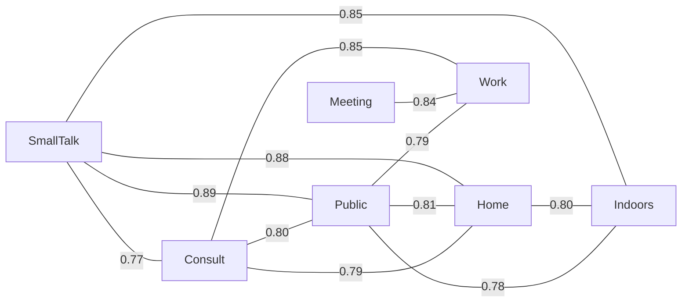

# Domain Similarity Analysis

**Source:** CEJC — Corpus of Everyday Japanese Conversation

How similar are the 11 conversation domains in terms of vocabulary? Two complementary measures are used:

1. **Jaccard similarity** — fraction of shared words among the top 300 words in each domain. Ranges 0 (no overlap) to 1 (identical vocabulary).
2. **Pearson rank correlation** — how similarly the two domains *rank* the same words across the top 3,000 overall words. A score near 1 means the domains agree on which words are more/less frequent; near 0 means no agreement.

The 11 domains break into two groups: **conversation types** (small talk, consultation, meeting, class) and **locations** (outdoors, school, transportation, public/commercial, home, indoors, workplace).

## Vocabulary Overlap — Jaccard Similarity

Pairs ranked by Jaccard similarity of their top-300 vocabulary. Higher = more shared words.

| Domain A          | Domain B          | Shared Words | Jaccard | Pearson r |
| ----------------- | ----------------- | ------------ | ------- | --------- |
| Small Talk        | Public/Commercial | 262          | 0.888   | 0.656     |
| Small Talk        | Home              | 261          | 0.879   | 0.666     |
| Small Talk        | Indoors           | 258          | 0.851   | 0.645     |
| Consultation      | Workplace         | 254          | 0.847   | 0.626     |
| Meeting           | Workplace         | 251          | 0.837   | 0.715     |
| Public/Commercial | Home              | 250          | 0.814   | 0.537     |
| Home              | Indoors           | 250          | 0.804   | 0.522     |
| Consultation      | Public/Commercial | 248          | 0.803   | 0.534     |
| Public/Commercial | Workplace         | 244          | 0.790   | 0.506     |
| Consultation      | Home              | 246          | 0.788   | 0.546     |
| Public/Commercial | Indoors           | 246          | 0.783   | 0.521     |
| Small Talk        | Consultation      | 242          | 0.766   | 0.375     |
| Consultation      | Indoors           | 243          | 0.764   | 0.460     |
| Small Talk        | Workplace         | 238          | 0.753   | 0.355     |
| Home              | Workplace         | 237          | 0.748   | 0.423     |
| Consultation      | Meeting           | 237          | 0.745   | 0.485     |
| Indoors           | Workplace         | 235          | 0.730   | 0.379     |
| Transportation    | Home              | 237          | 0.729   | 0.461     |
| Small Talk        | Transportation    | 236          | 0.724   | 0.455     |
| Meeting           | Public/Commercial | 230          | 0.710   | 0.443     |
| Small Talk        | Outdoors          | 232          | 0.703   | 0.408     |
| Transportation    | Indoors           | 233          | 0.702   | 0.469     |
| Consultation      | School            | 231          | 0.700   | 0.461     |
| School            | Workplace         | 228          | 0.693   | 0.477     |
| Meeting           | School            | 227          | 0.686   | 0.636     |
| Transportation    | Public/Commercial | 228          | 0.685   | 0.409     |
| Outdoors          | Home              | 228          | 0.683   | 0.406     |
| Outdoors          | Public/Commercial | 227          | 0.680   | 0.394     |
| School            | Public/Commercial | 226          | 0.677   | 0.407     |
| Small Talk        | Meeting           | 223          | 0.672   | 0.290     |
| Meeting           | Home              | 223          | 0.672   | 0.355     |
| School            | Home              | 225          | 0.670   | 0.387     |
| Small Talk        | School            | 223          | 0.660   | 0.347     |
| Meeting           | Indoors           | 220          | 0.651   | 0.308     |
| Transportation    | Workplace         | 220          | 0.651   | 0.370     |
| Outdoors          | Transportation    | 222          | 0.645   | 0.481     |
| Consultation      | Transportation    | 220          | 0.643   | 0.395     |
| Outdoors          | Indoors           | 221          | 0.642   | 0.433     |
| School            | Indoors           | 219          | 0.635   | 0.353     |
| Consultation      | Outdoors          | 216          | 0.624   | 0.424     |
| Outdoors          | Workplace         | 210          | 0.603   | 0.374     |
| Outdoors          | School            | 209          | 0.587   | 0.473     |
| School            | Transportation    | 209          | 0.587   | 0.434     |
| Class/Lesson      | Workplace         | 206          | 0.584   | 0.405     |
| Meeting           | Transportation    | 205          | 0.579   | 0.385     |
| Class/Lesson      | Public/Commercial | 206          | 0.579   | 0.420     |
| Consultation      | Class/Lesson      | 205          | 0.573   | 0.387     |
| Class/Lesson      | Home              | 203          | 0.564   | 0.363     |
| Small Talk        | Class/Lesson      | 202          | 0.560   | 0.315     |
| Meeting           | Class/Lesson      | 200          | 0.556   | 0.451     |
| Meeting           | Outdoors          | 197          | 0.544   | 0.393     |
| Class/Lesson      | Indoors           | 198          | 0.538   | 0.383     |
| Class/Lesson      | School            | 197          | 0.534   | 0.507     |
| Class/Lesson      | Transportation    | 194          | 0.520   | 0.442     |
| Class/Lesson      | Outdoors          | 188          | 0.496   | 0.489     |

## Rank Correlation Matrix (Pearson r)

Full pairwise Pearson correlation of domain rank vectors over the top 3,000 words. Cells closer to 1.0 = the two domains rank words in a similar order.

| Domain            | SmallTalk | Consult | Meeting | Class | Outdoors | School | Transit | Public | Home  | Indoors | Work  |
| ----------------- | --------- | ------- | ------- | ----- | -------- | ------ | ------- | ------ | ----- | ------- | ----- |
| Small Talk        | 1.000     | 0.375   | 0.290   | 0.315 | 0.408    | 0.347  | 0.455   | 0.656  | 0.666 | 0.645   | 0.355 |
| Consultation      | 0.375     | 1.000   | 0.485   | 0.387 | 0.424    | 0.461  | 0.395   | 0.534  | 0.546 | 0.460   | 0.626 |
| Meeting           | 0.290     | 0.485   | 1.000   | 0.451 | 0.393    | 0.636  | 0.385   | 0.443  | 0.355 | 0.308   | 0.715 |
| Class/Lesson      | 0.315     | 0.387   | 0.451   | 1.000 | 0.489    | 0.507  | 0.442   | 0.420  | 0.363 | 0.383   | 0.405 |
| Outdoors          | 0.408     | 0.424   | 0.393   | 0.489 | 1.000    | 0.473  | 0.481   | 0.394  | 0.406 | 0.433   | 0.374 |
| School            | 0.347     | 0.461   | 0.636   | 0.507 | 0.473    | 1.000  | 0.434   | 0.407  | 0.387 | 0.353   | 0.477 |
| Transportation    | 0.455     | 0.395   | 0.385   | 0.442 | 0.481    | 0.434  | 1.000   | 0.409  | 0.461 | 0.469   | 0.370 |
| Public/Commercial | 0.656     | 0.534   | 0.443   | 0.420 | 0.394    | 0.407  | 0.409   | 1.000  | 0.537 | 0.521   | 0.506 |
| Home              | 0.666     | 0.546   | 0.355   | 0.363 | 0.406    | 0.387  | 0.461   | 0.537  | 1.000 | 0.522   | 0.423 |
| Indoors           | 0.645     | 0.460   | 0.308   | 0.383 | 0.433    | 0.353  | 0.469   | 0.521  | 0.522 | 1.000   | 0.379 |
| Workplace         | 0.355     | 0.626   | 0.715   | 0.405 | 0.374    | 0.477  | 0.370   | 0.506  | 0.423 | 0.379   | 1.000 |

## Similarity Graph (top 12 strongest Jaccard pairs)

Each edge connects two domains with high vocabulary overlap. Edge labels show the Jaccard similarity score. Clusters of tightly connected nodes share a similar vocabulary profile.

## Key Insights

- **Most similar pair:** Small Talk × Public/Commercial (Jaccard = 0.888, 262 shared words in top 300). These domains share the largest core vocabulary.

- **Least similar pair:** Class/Lesson × Outdoors (Jaccard = 0.496, 188 shared words). These domains have the most distinct vocabularies.

- **Conversation-type domains are more similar to each other** (avg Jaccard = 0.645) than location domains are (0.692), and both are more similar within their group than across groups (0.683). This suggests that *what kind of conversation* matters more for vocabulary than *where* it takes place.

- **Indoors and Home cluster tightly** — much of 'home' conversation takes place indoors, making these two location categories partially redundant. Their high overlap reflects corpus recording conditions.

- **Transportation and Public/Commercial are the most isolated** location domains. These settings feature shorter, more transactional exchanges with distinctive vocabulary that doesn't generalise well to other contexts.
