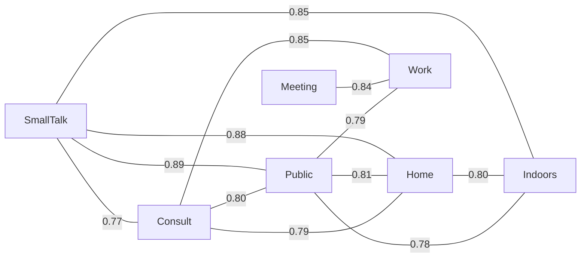

# Domain Similarity Analysis

**Source:** CEJC — Corpus of Everyday Japanese Conversation

How similar are the 11 conversation domains in terms of vocabulary? Two complementary measures are used:

1. **Jaccard similarity** — fraction of shared words among the top 300 words in each domain. Ranges 0 (no overlap) to 1 (identical vocabulary).
2. **Pearson rank correlation** — how similarly the two domains *rank* the same words across the top 3,000 overall words. A score near 1 means the domains agree on which words are more/less frequent; near 0 means no agreement.

The 11 domains break into two groups: **conversation types** (small talk, consultation, meeting, class) and **locations** (outdoors, school, transportation, public/commercial, home, indoors, workplace).

## Vocabulary Overlap — Jaccard Similarity

Pairs ranked by Jaccard similarity of their top-300 vocabulary. Higher = more shared words.

| Domain A          | Domain B          | Shared Words | Jaccard | Pearson r |
| ----------------- | ----------------- | ------------ | ------- | --------- |
| Small Talk        | Public/Commercial | 262          | 0.888   | 0.796     |
| Small Talk        | Home              | 261          | 0.879   | 0.772     |
| Small Talk        | Indoors           | 258          | 0.851   | 0.735     |
| Consultation      | Workplace         | 254          | 0.847   | 0.719     |
| Meeting           | Workplace         | 251          | 0.837   | 0.755     |
| Public/Commercial | Home              | 250          | 0.814   | 0.684     |
| Home              | Indoors           | 250          | 0.804   | 0.651     |
| Consultation      | Public/Commercial | 248          | 0.803   | 0.675     |
| Public/Commercial | Workplace         | 244          | 0.790   | 0.637     |
| Consultation      | Home              | 246          | 0.788   | 0.676     |
| Public/Commercial | Indoors           | 246          | 0.783   | 0.659     |
| Small Talk        | Consultation      | 242          | 0.766   | 0.581     |
| Consultation      | Indoors           | 243          | 0.764   | 0.601     |
| Small Talk        | Workplace         | 238          | 0.753   | 0.553     |
| Home              | Workplace         | 237          | 0.748   | 0.576     |
| Consultation      | Meeting           | 237          | 0.745   | 0.569     |
| Indoors           | Workplace         | 235          | 0.730   | 0.530     |
| Transportation    | Home              | 237          | 0.729   | 0.516     |
| Small Talk        | Transportation    | 236          | 0.724   | 0.482     |
| Meeting           | Public/Commercial | 230          | 0.710   | 0.537     |
| Small Talk        | Outdoors          | 232          | 0.703   | 0.438     |
| Transportation    | Indoors           | 233          | 0.702   | 0.525     |
| Consultation      | School            | 231          | 0.700   | 0.508     |
| School            | Workplace         | 228          | 0.693   | 0.520     |
| Meeting           | School            | 227          | 0.686   | 0.663     |
| Transportation    | Public/Commercial | 228          | 0.685   | 0.471     |
| Outdoors          | Home              | 228          | 0.683   | 0.464     |
| Outdoors          | Public/Commercial | 227          | 0.680   | 0.447     |
| School            | Public/Commercial | 226          | 0.677   | 0.455     |
| Small Talk        | Meeting           | 223          | 0.672   | 0.433     |
| Meeting           | Home              | 223          | 0.672   | 0.474     |
| School            | Home              | 225          | 0.670   | 0.446     |
| Small Talk        | School            | 223          | 0.660   | 0.397     |
| Meeting           | Indoors           | 220          | 0.651   | 0.430     |
| Transportation    | Workplace         | 220          | 0.651   | 0.444     |
| Outdoors          | Transportation    | 222          | 0.645   | 0.517     |
| Consultation      | Transportation    | 220          | 0.643   | 0.466     |
| Outdoors          | Indoors           | 221          | 0.642   | 0.487     |
| School            | Indoors           | 219          | 0.635   | 0.421     |
| Consultation      | Outdoors          | 216          | 0.624   | 0.480     |
| Outdoors          | Workplace         | 210          | 0.603   | 0.439     |
| Outdoors          | School            | 209          | 0.587   | 0.506     |
| School            | Transportation    | 209          | 0.587   | 0.473     |
| Class/Lesson      | Workplace         | 206          | 0.584   | 0.442     |
| Meeting           | Transportation    | 205          | 0.579   | 0.444     |
| Class/Lesson      | Public/Commercial | 206          | 0.579   | 0.440     |
| Consultation      | Class/Lesson      | 205          | 0.573   | 0.426     |
| Class/Lesson      | Home              | 203          | 0.564   | 0.403     |
| Small Talk        | Class/Lesson      | 202          | 0.560   | 0.341     |
| Meeting           | Class/Lesson      | 200          | 0.556   | 0.483     |
| Meeting           | Outdoors          | 197          | 0.544   | 0.447     |
| Class/Lesson      | Indoors           | 198          | 0.538   | 0.422     |
| Class/Lesson      | School            | 197          | 0.534   | 0.530     |
| Class/Lesson      | Transportation    | 194          | 0.520   | 0.472     |
| Class/Lesson      | Outdoors          | 188          | 0.496   | 0.514     |

## Rank Correlation Matrix (Pearson r)

Full pairwise Pearson correlation of domain rank vectors over the top 3,000 words. Cells closer to 1.0 = the two domains rank words in a similar order.

| Domain            | SmallTalk | Consult | Meeting | Class | Outdoors | School | Transit | Public | Home  | Indoors | Work  |
| ----------------- | --------- | ------- | ------- | ----- | -------- | ------ | ------- | ------ | ----- | ------- | ----- |
| Small Talk        | 1.000     | 0.581   | 0.433   | 0.341 | 0.438    | 0.397  | 0.482   | 0.796  | 0.772 | 0.735   | 0.553 |
| Consultation      | 0.581     | 1.000   | 0.569   | 0.426 | 0.480    | 0.508  | 0.466   | 0.675  | 0.676 | 0.601   | 0.719 |
| Meeting           | 0.433     | 0.569   | 1.000   | 0.483 | 0.447    | 0.663  | 0.444   | 0.537  | 0.474 | 0.430   | 0.755 |
| Class/Lesson      | 0.341     | 0.426   | 0.483   | 1.000 | 0.514    | 0.530  | 0.472   | 0.440  | 0.403 | 0.422   | 0.442 |
| Outdoors          | 0.438     | 0.480   | 0.447   | 0.514 | 1.000    | 0.506  | 0.517   | 0.447  | 0.464 | 0.487   | 0.439 |
| School            | 0.397     | 0.508   | 0.663   | 0.530 | 0.506    | 1.000  | 0.473   | 0.455  | 0.446 | 0.421   | 0.520 |
| Transportation    | 0.482     | 0.466   | 0.444   | 0.472 | 0.517    | 0.473  | 1.000   | 0.471  | 0.516 | 0.525   | 0.444 |
| Public/Commercial | 0.796     | 0.675   | 0.537   | 0.440 | 0.447    | 0.455  | 0.471   | 1.000  | 0.684 | 0.659   | 0.637 |
| Home              | 0.772     | 0.676   | 0.474   | 0.403 | 0.464    | 0.446  | 0.516   | 0.684  | 1.000 | 0.651   | 0.576 |
| Indoors           | 0.735     | 0.601   | 0.430   | 0.422 | 0.487    | 0.421  | 0.525   | 0.659  | 0.651 | 1.000   | 0.530 |
| Workplace         | 0.553     | 0.719   | 0.755   | 0.442 | 0.439    | 0.520  | 0.444   | 0.637  | 0.576 | 0.530   | 1.000 |

## Similarity Graph (top 12 strongest Jaccard pairs)

Each edge connects two domains with high vocabulary overlap. Edge labels show the Jaccard similarity score. Clusters of tightly connected nodes share a similar vocabulary profile.

## Key Insights

- **Most similar pair:** Small Talk × Public/Commercial (Jaccard = 0.888, 262 shared words in top 300). These domains share the largest core vocabulary.

- **Least similar pair:** Class/Lesson × Outdoors (Jaccard = 0.496, 188 shared words). These domains have the most distinct vocabularies.

- **Conversation-type domains are more similar to each other** (avg Jaccard = 0.645) than location domains are (0.692), and both are more similar within their group than across groups (0.683). This suggests that *what kind of conversation* matters more for vocabulary than *where* it takes place.

- **Indoors and Home cluster tightly** — much of 'home' conversation takes place indoors, making these two location categories partially redundant. Their high overlap reflects corpus recording conditions.

- **Transportation and Public/Commercial are the most isolated** location domains. These settings feature shorter, more transactional exchanges with distinctive vocabulary that doesn't generalise well to other contexts.
