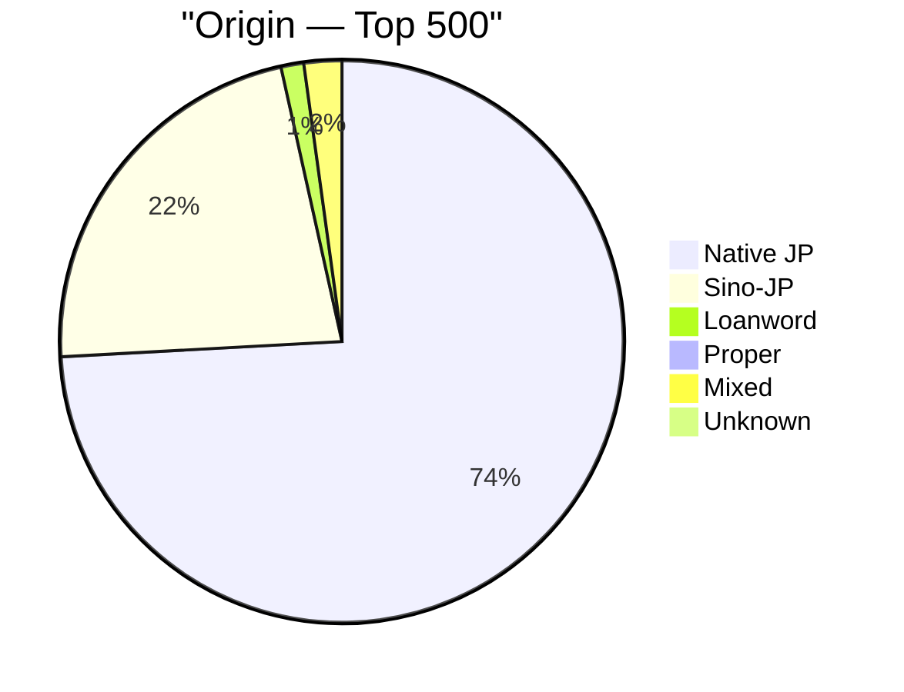
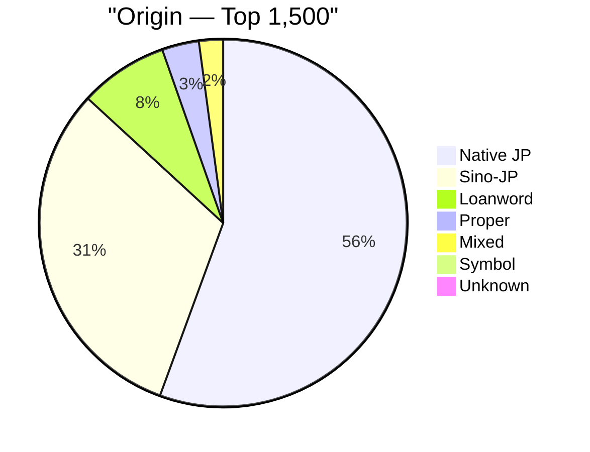
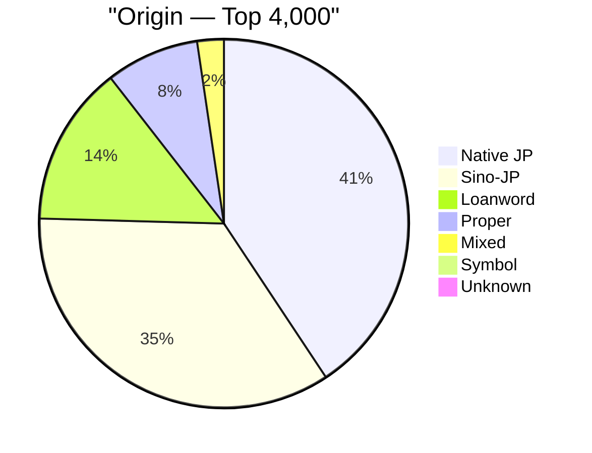
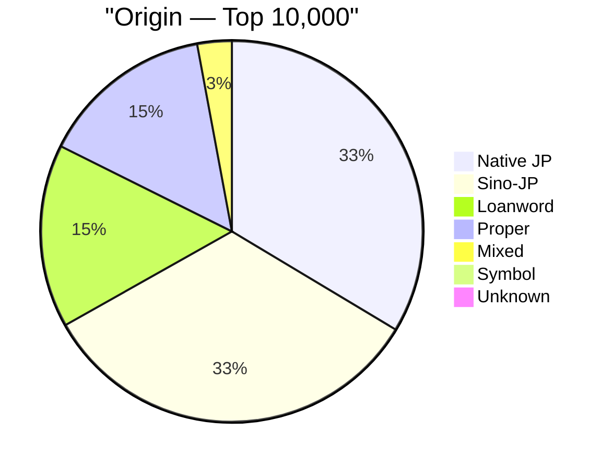
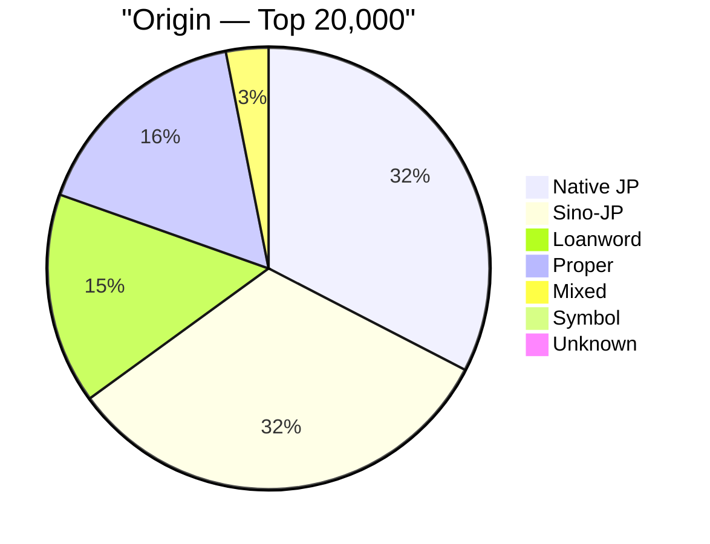

# Word Origin Trends Across Frequency Tiers

**Source:** CEJC — Corpus of Everyday Japanese Conversation

Japanese vocabulary is divided into four main origin types:
- **Native Japanese (和語)** — words with Old Japanese roots, the grammatical core of the language
- **Sino-Japanese (漢語)** — words borrowed from Chinese, typically written in kanji, often formal or technical
- **Foreign Loanwords (外来語)** — borrowed from other languages (mostly English), written in katakana
- **Mixed Origin (混種語)** — hybrid words combining elements from different origin types

This analysis shows how the balance between these origin types shifts as you move from the most frequent words down to the full vocabulary breadth. **Each tier is cumulative** — top 500 means words ranked 1–500.

## Origin Composition by Tier

Each row is a cumulative tier. The stacked bar shows the proportional breakdown of word origins. Watch how native Japanese (█) shrinks and Sino-Japanese / loanwords / proper nouns grow as the tier expands.

```
Top    500  █████████████████████████████████████▓▓▓▓▓▓▓▓▓▓▓▒▄  Native JP:74%  Sino-JP:22%  Loanword:1%  Proper:0%  Mixed:2%  Unknown:0%  Symbol:0%
Top  1,500  ████████████████████████████▓▓▓▓▓▓▓▓▓▓▓▓▓▓▓▓▒▒▒▒░░  Native JP:56%  Sino-JP:31%  Loanword:8%  Proper:3%  Mixed:2%  Unknown:0%  Symbol:0%
Top  4,000  ████████████████████▓▓▓▓▓▓▓▓▓▓▓▓▓▓▓▓▓▒▒▒▒▒▒▒░░░░▄   Native JP:41%  Sino-JP:35%  Loanword:14%  Proper:8%  Mixed:2%  Unknown:0%  Symbol:0%
Top 10,000  █████████████████▓▓▓▓▓▓▓▓▓▓▓▓▓▓▓▓▓▒▒▒▒▒▒▒▒░░░░░░░▄  Native JP:33%  Sino-JP:33%  Loanword:16%  Proper:15%  Mixed:3%  Unknown:0%  Symbol:0%
Top 20,000  ████████████████▓▓▓▓▓▓▓▓▓▓▓▓▓▓▓▓▒▒▒▒▒▒▒▒░░░░░░░░▄▄  Native JP:32%  Sino-JP:32%  Loanword:15%  Proper:16%  Mixed:3%  Unknown:0%  Symbol:1%

Legend: █ = Native JP  ▓ = Sino-JP  ▒ = Loanword  ░ = Proper  ▄ = Mixed  ▀ = Unknown  █ = Symbol
```

## Percentage Breakdown Table

Exact percentages per tier. The most important columns to watch are **Native JP** (and) and **Sino-JP** (漢) — their crossover point reveals where the Sino-Japanese vocabulary overtakes the native core.

| Tier       | Total Words | Native JP | Sino-JP | Loanword | Proper | Mixed | Symbol | Unknown |
| ---------- | ----------- | --------- | ------- | -------- | ------ | ----- | ------ | ------- |
| Top 500    | 463         | 73.7%     | 22.2%   | 1.3%     | 0.4%   | 2.2%  | 0.0%   | 0.2%    |
| Top 1,500  | 1,416       | 55.5%     | 31.2%   | 7.8%     | 3.2%   | 2.1%  | 0.1%   | 0.1%    |
| Top 4,000  | 3,908       | 40.6%     | 34.7%   | 14.0%    | 8.2%   | 2.3%  | 0.2%   | 0.0%    |
| Top 10,000 | 9,573       | 33.4%     | 33.1%   | 15.5%    | 14.6%  | 2.9%  | 0.5%   | 0.0%    |
| Top 20,000 | 12,796      | 32.4%     | 32.2%   | 15.3%    | 16.4%  | 3.1%  | 0.6%   | 0.0%    |

## Pie Charts by Tier











## Key Insights

- **Native Japanese dominates the core.** 73.7% of the top-500 words are 和語, falling to 32.4% by the full vocabulary. The highest-frequency words — particles, auxiliaries, common verbs — are almost exclusively native Japanese.

- **Native Japanese remains the largest single origin type** throughout all tiers, though the gap with Sino-Japanese narrows significantly at deeper tiers.

- **Loanwords grow steadily but plateau.** Foreign loanwords rise from 1.3% at the top-500 to 15.3% by the full vocabulary. Most high-frequency loanwords are everyday katakana words; lower-frequency loanwords include specialist and technical terms.

- **Proper nouns (16.4% at full vocabulary) are a significant slice.** This reflects that a substantial portion of real-world vocabulary consists of names of people, places, and countries — not just common words.

- **Mixed-origin words (混種語) grow slowly but steadily.** These hybrids (e.g. 打ち合わせ combining 漢 and 和 elements) accumulate as vocabulary expands, reflecting the blended nature of modern Japanese.
