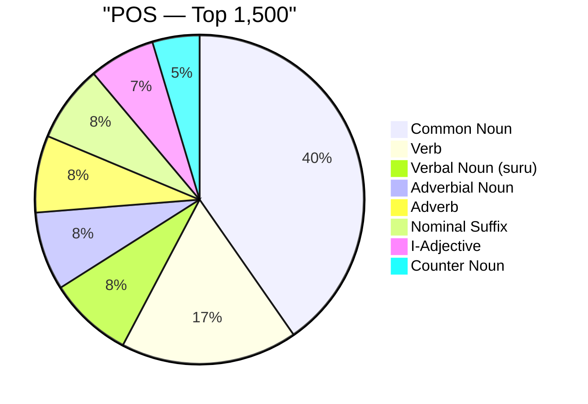
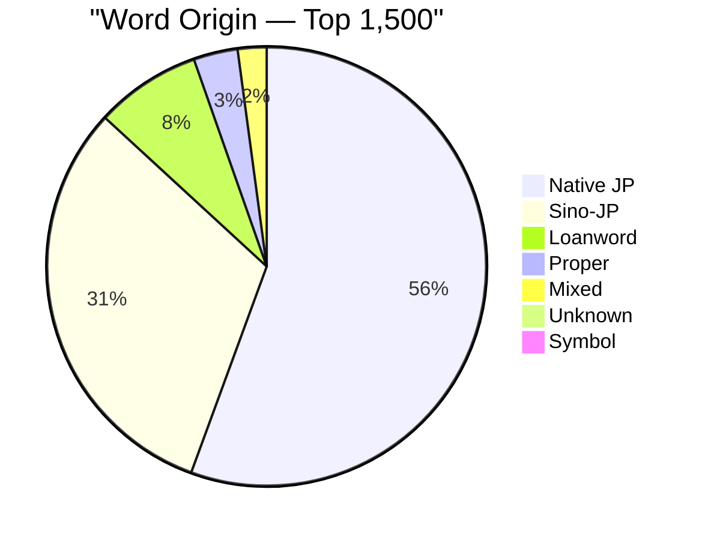
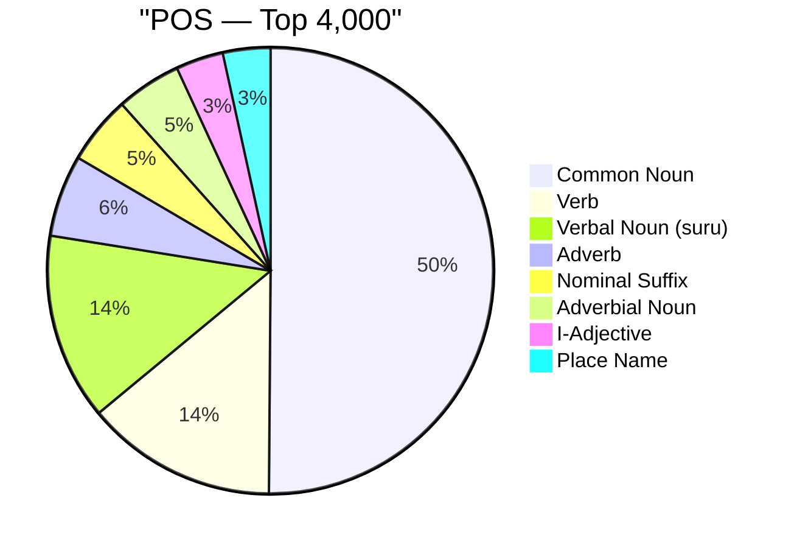
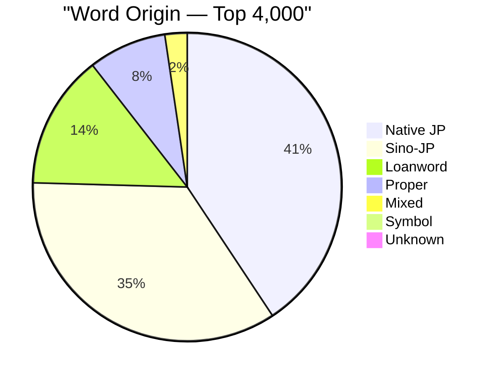
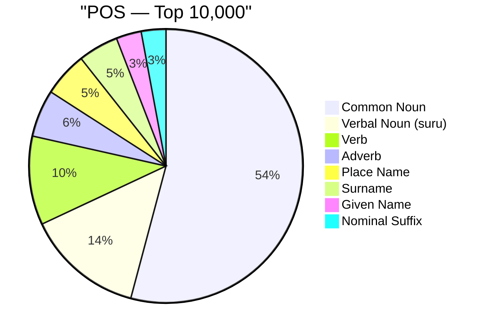
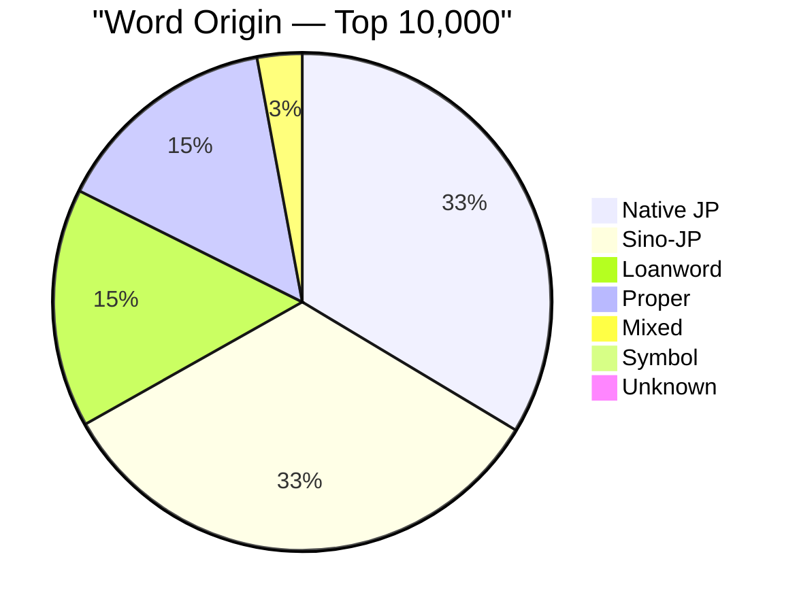
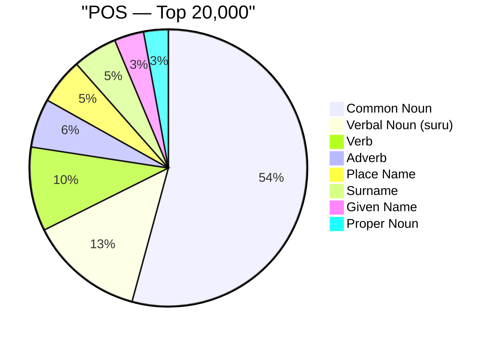
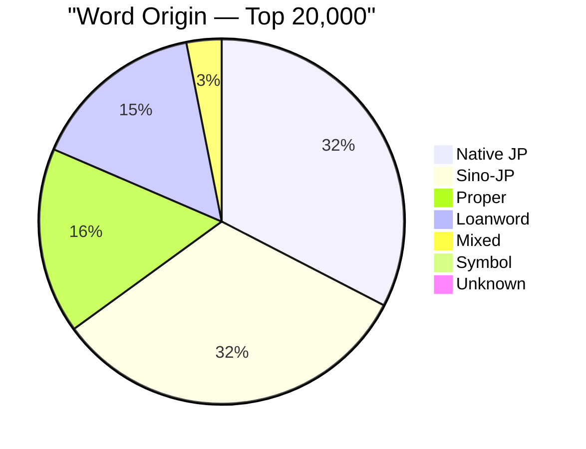

# Vocabulary Tier Breakdown

**Source:** CEJC — Corpus of Everyday Japanese Conversation  
**Tiers are cumulative** — 'top 1,500' = words ranked 1–1,500 by overall frequency across the entire ~2.4 million-word spoken corpus.

Each word can appear multiple times if it belongs to more than one part-of-speech category (e.g. の as a case particle, nominaliser, and sentence-final particle). Charts that say 'POS entries' count each grammatical role separately; charts that say 'unique words' count each word only once.

---

## Top 1,500 Words

**1,416 unique words · 1,717 POS entries**

### Part of Speech Distribution

What grammatical roles make up this vocabulary tier? Each bar represents one POS category. Because a single word can fill multiple roles, the total entries may exceed the unique word count. This chart reveals the grammatical character of high-frequency Japanese — for example, whether nouns, verbs, or particles dominate everyday speech.

```
Common Noun              ████████████████████████████████████████     496.0  (28.9%)
Verb                     █████████████████                            214.0  (12.5%)
Verbal Noun (suru)       ████████                                     102.0  (5.9%)
Adverbial Noun           ████████                                      95.0  (5.5%)
Adverb                   ████████                                      93.0  (5.4%)
Nominal Suffix           ████████                                      93.0  (5.4%)
I-Adjective              ██████                                        80.0  (4.7%)
Counter Noun             █████                                         57.0  (3.3%)
Numeral                  ████                                          50.0  (2.9%)
Aux. Verb                ████                                          48.0  (2.8%)
Na-Adjective             ███                                           37.0  (2.2%)
Interjection             ███                                           33.0  (1.9%)
Pronoun                  ███                                           33.0  (1.9%)
Nominal Adjective        ███                                           33.0  (1.9%)
Auxiliary                ██                                            25.0  (1.5%)
Prefix                   ██                                            25.0  (1.5%)
Sentence-final Particle  ██                                            19.0  (1.1%)
Place Name               █                                             18.0  (1.0%)
Adverbial Particle       █                                             17.0  (1.0%)
Pre-noun Adjectival      █                                             14.0  (0.8%)
Person Name              █                                             13.0  (0.8%)
Conjunctive Particle     █                                             11.0  (0.6%)
Given Name               █                                             11.0  (0.6%)
Conjunction              █                                             10.0  (0.6%)
Filler                   █                                             10.0  (0.6%)
Case Particle            █                                              9.0  (0.5%)
Counter Suffix           █                                              9.0  (0.5%)
Adverbial Suffix         █                                              8.0  (0.5%)
Adjectival Suffix        █                                              7.0  (0.4%)
Verbal+Adj Noun          █                                              7.0  (0.4%)
Country Name                                                            6.0  (0.3%)
Proper Noun                                                             6.0  (0.3%)
Topic Particle                                                          5.0  (0.3%)
Na-Adj Suffix                                                           4.0  (0.2%)
Copula Stem                                                             3.0  (0.2%)
Dependent I-Adj                                                         3.0  (0.2%)
Verbal Suffix                                                           2.0  (0.1%)
Verbal Suffix (v)                                                       2.0  (0.1%)
Surname                                                                 2.0  (0.1%)
Nominalizer Particle                                                    1.0  (0.1%)
Copula Noun                                                             1.0  (0.1%)
Hesitation                                                              1.0  (0.1%)
Unanalyzed                                                              1.0  (0.1%)
Censored                                                                1.0  (0.1%)
Song/Lyric                                                              1.0  (0.1%)
Babbling                                                                1.0  (0.1%)
```

| Part of Speech (EN)     | 品詞 (JP)                    | Entries | %     |
| ----------------------- | ---------------------------- | ------- | ----- |
| Common Noun             | 名詞-普通名詞-一般           | 496     | 28.9% |
| Verb                    | 動詞-一般                    | 214     | 12.5% |
| Verbal Noun (suru)      | 名詞-普通名詞-サ変可能       | 102     | 5.9%  |
| Adverbial Noun          | 名詞-普通名詞-副詞可能       | 95      | 5.5%  |
| Adverb                  | 副詞                         | 93      | 5.4%  |
| Nominal Suffix          | 接尾辞-名詞的-一般           | 93      | 5.4%  |
| I-Adjective             | 形容詞-一般                  | 80      | 4.7%  |
| Counter Noun            | 名詞-普通名詞-助数詞可能     | 57      | 3.3%  |
| Numeral                 | 名詞-数詞                    | 50      | 2.9%  |
| Aux. Verb               | 動詞-非自立可能              | 48      | 2.8%  |
| Na-Adjective            | 形状詞-一般                  | 37      | 2.2%  |
| Interjection            | 感動詞-一般                  | 33      | 1.9%  |
| Pronoun                 | 代名詞                       | 33      | 1.9%  |
| Nominal Adjective       | 名詞-普通名詞-形状詞可能     | 33      | 1.9%  |
| Auxiliary               | 助動詞                       | 25      | 1.5%  |
| Prefix                  | 接頭辞                       | 25      | 1.5%  |
| Sentence-final Particle | 助詞-終助詞                  | 19      | 1.1%  |
| Place Name              | 名詞-固有名詞-地名-一般      | 18      | 1.0%  |
| Adverbial Particle      | 助詞-副助詞                  | 17      | 1.0%  |
| Pre-noun Adjectival     | 連体詞                       | 14      | 0.8%  |
| Person Name             | 名詞-固有名詞-人名-一般      | 13      | 0.8%  |
| Conjunctive Particle    | 助詞-接続助詞                | 11      | 0.6%  |
| Given Name              | 名詞-固有名詞-人名-名        | 11      | 0.6%  |
| Conjunction             | 接続詞                       | 10      | 0.6%  |
| Filler                  | 感動詞-フィラー              | 10      | 0.6%  |
| Case Particle           | 助詞-格助詞                  | 9       | 0.5%  |
| Counter Suffix          | 接尾辞-名詞的-助数詞         | 9       | 0.5%  |
| Adverbial Suffix        | 接尾辞-名詞的-副詞可能       | 8       | 0.5%  |
| Adjectival Suffix       | 接尾辞-形容詞的              | 7       | 0.4%  |
| Verbal+Adj Noun         | 名詞-普通名詞-サ変形状詞可能 | 7       | 0.4%  |
| Country Name            | 名詞-固有名詞-地名-国        | 6       | 0.3%  |
| Proper Noun             | 名詞-固有名詞-一般           | 6       | 0.3%  |
| Topic Particle          | 助詞-係助詞                  | 5       | 0.3%  |
| Na-Adj Suffix           | 接尾辞-形状詞的              | 4       | 0.2%  |
| Copula Stem             | 形状詞-助動詞語幹            | 3       | 0.2%  |
| Dependent I-Adj         | 形容詞-非自立可能            | 3       | 0.2%  |
| Verbal Suffix           | 接尾辞-名詞的-サ変可能       | 2       | 0.1%  |
| Verbal Suffix (v)       | 接尾辞-動詞的                | 2       | 0.1%  |
| Surname                 | 名詞-固有名詞-人名-姓        | 2       | 0.1%  |
| Nominalizer Particle    | 助詞-準体助詞                | 1       | 0.1%  |
| Copula Noun             | 名詞-助動詞語幹              | 1       | 0.1%  |
| Hesitation              | 言いよどみ                   | 1       | 0.1%  |
| Unanalyzed              | 形態論情報付与対象外         | 1       | 0.1%  |
| Censored                | 伏せ字                       | 1       | 0.1%  |
| Song/Lyric              | 歌                           | 1       | 0.1%  |
| Babbling                | 喃語                         | 1       | 0.1%  |



### Word Origin Distribution

Japanese vocabulary is classified into four main origin types: native Japanese (和語), Sino-Japanese (漢語 — words borrowed from Chinese and written with kanji), foreign loanwords (外来語 — mainly from English, written in katakana), and mixed-origin words (混種語). This distribution shifts dramatically across frequency tiers, revealing how the character of the vocabulary changes as you go deeper.

```
Native JP  ████████████████████████████████████████     786.0  (55.5%)
Sino-JP    ██████████████████████                       442.0  (31.2%)
Loanword   ██████                                       110.0  (7.8%)
Proper     ██                                            46.0  (3.2%)
Mixed      ██                                            30.0  (2.1%)
Unknown                                                   1.0  (0.1%)
Symbol                                                    1.0  (0.1%)
```

| Origin (EN)               | 語種 (JP) | Unique Words | %     |
| ------------------------- | --------- | ------------ | ----- |
| Native Japanese (和語)    | 和        | 786          | 55.5% |
| Sino-Japanese (漢語)      | 漢        | 442          | 31.2% |
| Foreign Loanword (外来語) | 外        | 110          | 7.8%  |
| Proper Noun Origin (固有) | 固        | 46           | 3.2%  |
| Mixed Origin (混種語)     | 混        | 30           | 2.1%  |
| (Unknown)                 |           | 1            | 0.1%  |
| Symbol / Other            | 記号      | 1            | 0.1%  |



### Subcategory Distribution (Top 15)

A finer-grained classification within each POS. Most entries have no subcategory (shown as blank / '-1') — subcategories are only assigned to grammatically irregular or specialised forms. The non-blank entries here are mostly corpus annotations or proper noun sub-types.

```
(none)          ████████████████████████████████████████    1578.0  (98.8%)
代名詞                                                         4.0  (0.3%)
okay                                                           2.0  (0.1%)
他動詞                                                         2.0  (0.1%)
様態                                                           1.0  (0.1%)
伝聞                                                           1.0  (0.1%)
接続詞                                                         1.0  (0.1%)
（オノマトペ）                                                 1.0  (0.1%)
断定                                                           1.0  (0.1%)
助数詞                                                         1.0  (0.1%)
中学校                                                         1.0  (0.1%)
mama                                                           1.0  (0.1%)
papa                                                           1.0  (0.1%)
pao                                                            1.0  (0.1%)
bus                                                            1.0  (0.1%)
```

| Subcategory    | Entries | %     |
| -------------- | ------- | ----- |
| (none)         | 1578    | 91.9% |
| 代名詞         | 4       | 0.2%  |
| okay           | 2       | 0.1%  |
| 他動詞         | 2       | 0.1%  |
| 様態           | 1       | 0.1%  |
| 伝聞           | 1       | 0.1%  |
| 接続詞         | 1       | 0.1%  |
| （オノマトペ） | 1       | 0.1%  |
| 断定           | 1       | 0.1%  |
| 助数詞         | 1       | 0.1%  |
| 中学校         | 1       | 0.1%  |
| mama           | 1       | 0.1%  |
| papa           | 1       | 0.1%  |
| pao            | 1       | 0.1%  |
| bus            | 1       | 0.1%  |

### Origin × POS Cross-tabulation (top 6 POS)

How do word origins interact with grammatical role? For example: are Sino-Japanese words more likely to be nouns than verbs? Are loanwords exclusively nouns? This table answers those questions. Rows are origin types; columns are the most frequent POS categories.

| Origin    | Common Noun | Verb | Verbal Noun (suru) | Adverbial Noun | Adverb | Nominal Suffix |
| --------- | ----------- | ---- | ------------------ | -------------- | ------ | -------------- |
| Native JP | 198         | 208  | 7                  | 47             | 74     | 55             |
| Sino-JP   | 194         | 0    | 81                 | 46             | 17     | 38             |
| Loanword  | 91          | 0    | 14                 | 0              | 0      | 0              |
| Proper    | 2           | 0    | 0                  | 0              | 0      | 0              |
| Mixed     | 10          | 6    | 0                  | 2              | 2      | 0              |
| Unknown   | 0           | 0    | 0                  | 0              | 0      | 0              |
| Symbol    | 1           | 0    | 0                  | 0              | 0      | 0              |

### Key Insights

- **Native Japanese dominates the core.** Over half (55%) of the top-1,500 words are native Japanese (和語). These are the grammatical glue words, basic verbs, and everyday nouns that make up the backbone of spoken Japanese.

- **Verbs are disproportionately native.** Of the 214 general verb entries, almost all are 和語 — Sino-Japanese verbs are rare because they are expressed as verbal nouns + する (e.g. 勉強する), which is why "Verbal Noun (suru)" is its own large category (5.9%).

- **Foreign loanwords are scarce at the top.** Only 7.8% of the top-1,500 are loanwords (外来語). The highest-frequency words are almost entirely native or Sino-Japanese — loanwords become more common as frequency rank decreases.

- **Subcategory is nearly meaningless here.** 98.8% of entries have no subcategory tag (-1 / blank). Subcategory is only assigned to a handful of grammatical edge cases in this corpus.

---

## Top 4,000 Words

**3,908 unique words · 4,382 POS entries**

### Part of Speech Distribution

What grammatical roles make up this vocabulary tier? Each bar represents one POS category. Because a single word can fill multiple roles, the total entries may exceed the unique word count. This chart reveals the grammatical character of high-frequency Japanese — for example, whether nouns, verbs, or particles dominate everyday speech.

```
Common Noun              ████████████████████████████████████████    1701.0  (38.8%)
Verb                     ███████████                                  471.0  (10.7%)
Verbal Noun (suru)       ███████████                                  459.0  (10.5%)
Adverb                   █████                                        201.0  (4.6%)
Nominal Suffix           ████                                         168.0  (3.8%)
Adverbial Noun           ████                                         160.0  (3.7%)
I-Adjective              ███                                          117.0  (2.7%)
Place Name               ███                                          117.0  (2.7%)
Counter Noun             ██                                            89.0  (2.0%)
Na-Adjective             ██                                            85.0  (1.9%)
Nominal Adjective        ██                                            76.0  (1.7%)
Interjection             ██                                            75.0  (1.7%)
Given Name               ██                                            72.0  (1.6%)
Numeral                  ██                                            69.0  (1.6%)
Surname                  █                                             58.0  (1.3%)
Aux. Verb                █                                             52.0  (1.2%)
Proper Noun              █                                             51.0  (1.2%)
Person Name              █                                             46.0  (1.0%)
Prefix                   █                                             40.0  (0.9%)
Pronoun                  █                                             37.0  (0.8%)
Auxiliary                █                                             30.0  (0.7%)
Adverbial Particle       █                                             23.0  (0.5%)
Country Name             █                                             22.0  (0.5%)
Verbal+Adj Noun          █                                             22.0  (0.5%)
Sentence-final Particle                                                21.0  (0.5%)
Conjunction                                                            15.0  (0.3%)
Pre-noun Adjectival                                                    15.0  (0.3%)
Conjunctive Particle                                                   12.0  (0.3%)
Adverbial Suffix                                                       12.0  (0.3%)
Filler                                                                 11.0  (0.3%)
Counter Suffix                                                         10.0  (0.2%)
Case Particle                                                           9.0  (0.2%)
Na-Adj Suffix                                                           7.0  (0.2%)
Adjectival Suffix                                                       7.0  (0.2%)
Topic Particle                                                          5.0  (0.1%)
Copula Stem                                                             3.0  (0.1%)
Dependent I-Adj                                                         3.0  (0.1%)
Verbal Suffix                                                           2.0  (0.0%)
Verbal Suffix (v)                                                       2.0  (0.0%)
Nominalizer Particle                                                    1.0  (0.0%)
Copula Noun                                                             1.0  (0.0%)
Hesitation                                                              1.0  (0.0%)
Unanalyzed                                                              1.0  (0.0%)
Censored                                                                1.0  (0.0%)
Song/Lyric                                                              1.0  (0.0%)
Babbling                                                                1.0  (0.0%)
```

| Part of Speech (EN)     | 品詞 (JP)                    | Entries | %     |
| ----------------------- | ---------------------------- | ------- | ----- |
| Common Noun             | 名詞-普通名詞-一般           | 1701    | 38.8% |
| Verb                    | 動詞-一般                    | 471     | 10.7% |
| Verbal Noun (suru)      | 名詞-普通名詞-サ変可能       | 459     | 10.5% |
| Adverb                  | 副詞                         | 201     | 4.6%  |
| Nominal Suffix          | 接尾辞-名詞的-一般           | 168     | 3.8%  |
| Adverbial Noun          | 名詞-普通名詞-副詞可能       | 160     | 3.7%  |
| I-Adjective             | 形容詞-一般                  | 117     | 2.7%  |
| Place Name              | 名詞-固有名詞-地名-一般      | 117     | 2.7%  |
| Counter Noun            | 名詞-普通名詞-助数詞可能     | 89      | 2.0%  |
| Na-Adjective            | 形状詞-一般                  | 85      | 1.9%  |
| Nominal Adjective       | 名詞-普通名詞-形状詞可能     | 76      | 1.7%  |
| Interjection            | 感動詞-一般                  | 75      | 1.7%  |
| Given Name              | 名詞-固有名詞-人名-名        | 72      | 1.6%  |
| Numeral                 | 名詞-数詞                    | 69      | 1.6%  |
| Surname                 | 名詞-固有名詞-人名-姓        | 58      | 1.3%  |
| Aux. Verb               | 動詞-非自立可能              | 52      | 1.2%  |
| Proper Noun             | 名詞-固有名詞-一般           | 51      | 1.2%  |
| Person Name             | 名詞-固有名詞-人名-一般      | 46      | 1.0%  |
| Prefix                  | 接頭辞                       | 40      | 0.9%  |
| Pronoun                 | 代名詞                       | 37      | 0.8%  |
| Auxiliary               | 助動詞                       | 30      | 0.7%  |
| Adverbial Particle      | 助詞-副助詞                  | 23      | 0.5%  |
| Country Name            | 名詞-固有名詞-地名-国        | 22      | 0.5%  |
| Verbal+Adj Noun         | 名詞-普通名詞-サ変形状詞可能 | 22      | 0.5%  |
| Sentence-final Particle | 助詞-終助詞                  | 21      | 0.5%  |
| Conjunction             | 接続詞                       | 15      | 0.3%  |
| Pre-noun Adjectival     | 連体詞                       | 15      | 0.3%  |
| Conjunctive Particle    | 助詞-接続助詞                | 12      | 0.3%  |
| Adverbial Suffix        | 接尾辞-名詞的-副詞可能       | 12      | 0.3%  |
| Filler                  | 感動詞-フィラー              | 11      | 0.3%  |
| Counter Suffix          | 接尾辞-名詞的-助数詞         | 10      | 0.2%  |
| Case Particle           | 助詞-格助詞                  | 9       | 0.2%  |
| Na-Adj Suffix           | 接尾辞-形状詞的              | 7       | 0.2%  |
| Adjectival Suffix       | 接尾辞-形容詞的              | 7       | 0.2%  |
| Topic Particle          | 助詞-係助詞                  | 5       | 0.1%  |
| Copula Stem             | 形状詞-助動詞語幹            | 3       | 0.1%  |
| Dependent I-Adj         | 形容詞-非自立可能            | 3       | 0.1%  |
| Verbal Suffix           | 接尾辞-名詞的-サ変可能       | 2       | 0.0%  |
| Verbal Suffix (v)       | 接尾辞-動詞的                | 2       | 0.0%  |
| Nominalizer Particle    | 助詞-準体助詞                | 1       | 0.0%  |
| Copula Noun             | 名詞-助動詞語幹              | 1       | 0.0%  |
| Hesitation              | 言いよどみ                   | 1       | 0.0%  |
| Unanalyzed              | 形態論情報付与対象外         | 1       | 0.0%  |
| Censored                | 伏せ字                       | 1       | 0.0%  |
| Song/Lyric              | 歌                           | 1       | 0.0%  |
| Babbling                | 喃語                         | 1       | 0.0%  |



### Word Origin Distribution

Japanese vocabulary is classified into four main origin types: native Japanese (和語), Sino-Japanese (漢語 — words borrowed from Chinese and written with kanji), foreign loanwords (外来語 — mainly from English, written in katakana), and mixed-origin words (混種語). This distribution shifts dramatically across frequency tiers, revealing how the character of the vocabulary changes as you go deeper.

```
Native JP  ████████████████████████████████████████    1587.0  (40.6%)
Sino-JP    ██████████████████████████████████          1355.0  (34.7%)
Loanword   ██████████████                               548.0  (14.0%)
Proper     ████████                                     319.0  (8.2%)
Mixed      ██                                            91.0  (2.3%)
Symbol                                                    7.0  (0.2%)
Unknown                                                   1.0  (0.0%)
```

| Origin (EN)               | 語種 (JP) | Unique Words | %     |
| ------------------------- | --------- | ------------ | ----- |
| Native Japanese (和語)    | 和        | 1587         | 40.6% |
| Sino-Japanese (漢語)      | 漢        | 1355         | 34.7% |
| Foreign Loanword (外来語) | 外        | 548          | 14.0% |
| Proper Noun Origin (固有) | 固        | 319          | 8.2%  |
| Mixed Origin (混種語)     | 混        | 91           | 2.3%  |
| Symbol / Other            | 記号      | 7            | 0.2%  |
| (Unknown)                 |           | 1            | 0.0%  |



### Subcategory Distribution (Top 15)

A finer-grained classification within each POS. Most entries have no subcategory (shown as blank / '-1') — subcategories are only assigned to grammatically irregular or specialised forms. The non-blank entries here are mostly corpus annotations or proper noun sub-types.

```
(none)     ████████████████████████████████████████    3757.0  (99.2%)
代名詞                                                    4.0  (0.1%)
断定                                                      2.0  (0.1%)
okay                                                      2.0  (0.1%)
他動詞                                                    2.0  (0.1%)
Arbeit                                                    2.0  (0.1%)
日本                                                      2.0  (0.1%)
percent                                                   2.0  (0.1%)
chocolate                                                 2.0  (0.1%)
外国                                                      2.0  (0.1%)
back                                                      2.0  (0.1%)
character                                                 2.0  (0.1%)
program                                                   2.0  (0.1%)
monitor                                                   2.0  (0.1%)
様態                                                      1.0  (0.0%)
```

| Subcategory | Entries | %     |
| ----------- | ------- | ----- |
| (none)      | 3757    | 85.7% |
| 代名詞      | 4       | 0.1%  |
| 断定        | 2       | 0.0%  |
| okay        | 2       | 0.0%  |
| 他動詞      | 2       | 0.0%  |
| Arbeit      | 2       | 0.0%  |
| 日本        | 2       | 0.0%  |
| percent     | 2       | 0.0%  |
| chocolate   | 2       | 0.0%  |
| 外国        | 2       | 0.0%  |
| back        | 2       | 0.0%  |
| character   | 2       | 0.0%  |
| program     | 2       | 0.0%  |
| monitor     | 2       | 0.0%  |
| 様態        | 1       | 0.0%  |

### Origin × POS Cross-tabulation (top 6 POS)

How do word origins interact with grammatical role? For example: are Sino-Japanese words more likely to be nouns than verbs? Are loanwords exclusively nouns? This table answers those questions. Rows are origin types; columns are the most frequent POS categories.

| Origin    | Common Noun | Verb | Verbal Noun (suru) | Adverb | Nominal Suffix | Adverbial Noun |
| --------- | ----------- | ---- | ------------------ | ------ | -------------- | -------------- |
| Native JP | 512         | 459  | 30                 | 164    | 80             | 67             |
| Sino-JP   | 681         | 0    | 346                | 30     | 88             | 88             |
| Loanword  | 451         | 0    | 83                 | 0      | 0              | 0              |
| Proper    | 6           | 0    | 0                  | 1      | 0              | 0              |
| Mixed     | 44          | 12   | 0                  | 6      | 0              | 5              |
| Symbol    | 7           | 0    | 0                  | 0      | 0              | 0              |
| Unknown   | 0           | 0    | 0                  | 0      | 0              | 0              |

### Key Insights

- **The 和語/漢語 gap narrows sharply.** Native Japanese drops from 55% to 41% while Sino-Japanese climbs from 31% to 35%. As frequency rank increases, more Sino-Japanese vocabulary enters — this reflects how 漢語 is used for technical, abstract, and formal concepts.

- **Loanwords nearly double.** Foreign loanwords jump from 7.8% → 14%, the single biggest relative increase of any origin category. Katakana loanwords for everyday objects and concepts (コーヒー, ニュース, etc.) start accumulating here.

- **Proper nouns appear for the first time.** The 固 (proper noun) category reaches 8.2%, mainly place names (地名) and personal names (人名). This reflects that many mid-frequency words in conversation are names of people and locations.

- **The vocabulary becomes more noun-heavy.** Common nouns rise from 28.9% → 38.8% of POS entries. As rank decreases, the vocabulary shifts from grammatical/functional words toward content words.

---

## Top 10,000 Words

**9,573 unique words · 10,210 POS entries**

### Part of Speech Distribution

What grammatical roles make up this vocabulary tier? Each bar represents one POS category. Because a single word can fill multiple roles, the total entries may exceed the unique word count. This chart reveals the grammatical character of high-frequency Japanese — for example, whether nouns, verbs, or particles dominate everyday speech.

```
Common Noun              ████████████████████████████████████████    4477.0  (43.8%)
Verbal Noun (suru)       ██████████                                  1148.0  (11.2%)
Verb                     ████████                                     867.0  (8.5%)
Adverb                   ████                                         461.0  (4.5%)
Place Name               ████                                         435.0  (4.3%)
Surname                  ████                                         393.0  (3.8%)
Given Name               ██                                           246.0  (2.4%)
Nominal Suffix           ██                                           241.0  (2.4%)
Adverbial Noun           ██                                           220.0  (2.2%)
Proper Noun              ██                                           207.0  (2.0%)
Na-Adjective             ██                                           203.0  (2.0%)
Person Name              ██                                           189.0  (1.9%)
Nominal Adjective        ██                                           169.0  (1.7%)
I-Adjective              █                                            157.0  (1.5%)
Counter Noun             █                                            126.0  (1.2%)
Interjection             █                                            125.0  (1.2%)
Numeral                  █                                             75.0  (0.7%)
Prefix                   █                                             66.0  (0.6%)
Aux. Verb                                                              55.0  (0.5%)
Pronoun                                                                45.0  (0.4%)
Auxiliary                                                              41.0  (0.4%)
Country Name                                                           40.0  (0.4%)
Verbal+Adj Noun                                                        32.0  (0.3%)
Sentence-final Particle                                                25.0  (0.2%)
Adverbial Particle                                                     24.0  (0.2%)
Pre-noun Adjectival                                                    20.0  (0.2%)
Conjunction                                                            19.0  (0.2%)
Adverbial Suffix                                                       14.0  (0.1%)
Conjunctive Particle                                                   13.0  (0.1%)
Counter Suffix                                                         13.0  (0.1%)
Filler                                                                 12.0  (0.1%)
Case Particle                                                           9.0  (0.1%)
Na-Adj Suffix                                                           8.0  (0.1%)
Adjectival Suffix                                                       7.0  (0.1%)
Topic Particle                                                          5.0  (0.0%)
Verbal Suffix (v)                                                       5.0  (0.0%)
Copula Stem                                                             3.0  (0.0%)
Dependent I-Adj                                                         3.0  (0.0%)
Tari-Adjective                                                          3.0  (0.0%)
Verbal Suffix                                                           2.0  (0.0%)
Nominalizer Particle                                                    1.0  (0.0%)
Copula Noun                                                             1.0  (0.0%)
Hesitation                                                              1.0  (0.0%)
Unanalyzed                                                              1.0  (0.0%)
Censored                                                                1.0  (0.0%)
Song/Lyric                                                              1.0  (0.0%)
Babbling                                                                1.0  (0.0%)
```

| Part of Speech (EN)     | 品詞 (JP)                    | Entries | %     |
| ----------------------- | ---------------------------- | ------- | ----- |
| Common Noun             | 名詞-普通名詞-一般           | 4477    | 43.8% |
| Verbal Noun (suru)      | 名詞-普通名詞-サ変可能       | 1148    | 11.2% |
| Verb                    | 動詞-一般                    | 867     | 8.5%  |
| Adverb                  | 副詞                         | 461     | 4.5%  |
| Place Name              | 名詞-固有名詞-地名-一般      | 435     | 4.3%  |
| Surname                 | 名詞-固有名詞-人名-姓        | 393     | 3.8%  |
| Given Name              | 名詞-固有名詞-人名-名        | 246     | 2.4%  |
| Nominal Suffix          | 接尾辞-名詞的-一般           | 241     | 2.4%  |
| Adverbial Noun          | 名詞-普通名詞-副詞可能       | 220     | 2.2%  |
| Proper Noun             | 名詞-固有名詞-一般           | 207     | 2.0%  |
| Na-Adjective            | 形状詞-一般                  | 203     | 2.0%  |
| Person Name             | 名詞-固有名詞-人名-一般      | 189     | 1.9%  |
| Nominal Adjective       | 名詞-普通名詞-形状詞可能     | 169     | 1.7%  |
| I-Adjective             | 形容詞-一般                  | 157     | 1.5%  |
| Counter Noun            | 名詞-普通名詞-助数詞可能     | 126     | 1.2%  |
| Interjection            | 感動詞-一般                  | 125     | 1.2%  |
| Numeral                 | 名詞-数詞                    | 75      | 0.7%  |
| Prefix                  | 接頭辞                       | 66      | 0.6%  |
| Aux. Verb               | 動詞-非自立可能              | 55      | 0.5%  |
| Pronoun                 | 代名詞                       | 45      | 0.4%  |
| Auxiliary               | 助動詞                       | 41      | 0.4%  |
| Country Name            | 名詞-固有名詞-地名-国        | 40      | 0.4%  |
| Verbal+Adj Noun         | 名詞-普通名詞-サ変形状詞可能 | 32      | 0.3%  |
| Sentence-final Particle | 助詞-終助詞                  | 25      | 0.2%  |
| Adverbial Particle      | 助詞-副助詞                  | 24      | 0.2%  |
| Pre-noun Adjectival     | 連体詞                       | 20      | 0.2%  |
| Conjunction             | 接続詞                       | 19      | 0.2%  |
| Adverbial Suffix        | 接尾辞-名詞的-副詞可能       | 14      | 0.1%  |
| Conjunctive Particle    | 助詞-接続助詞                | 13      | 0.1%  |
| Counter Suffix          | 接尾辞-名詞的-助数詞         | 13      | 0.1%  |
| Filler                  | 感動詞-フィラー              | 12      | 0.1%  |
| Case Particle           | 助詞-格助詞                  | 9       | 0.1%  |
| Na-Adj Suffix           | 接尾辞-形状詞的              | 8       | 0.1%  |
| Adjectival Suffix       | 接尾辞-形容詞的              | 7       | 0.1%  |
| Topic Particle          | 助詞-係助詞                  | 5       | 0.0%  |
| Verbal Suffix (v)       | 接尾辞-動詞的                | 5       | 0.0%  |
| Copula Stem             | 形状詞-助動詞語幹            | 3       | 0.0%  |
| Dependent I-Adj         | 形容詞-非自立可能            | 3       | 0.0%  |
| Tari-Adjective          | 形状詞-タリ                  | 3       | 0.0%  |
| Verbal Suffix           | 接尾辞-名詞的-サ変可能       | 2       | 0.0%  |
| Nominalizer Particle    | 助詞-準体助詞                | 1       | 0.0%  |
| Copula Noun             | 名詞-助動詞語幹              | 1       | 0.0%  |
| Hesitation              | 言いよどみ                   | 1       | 0.0%  |
| Unanalyzed              | 形態論情報付与対象外         | 1       | 0.0%  |
| Censored                | 伏せ字                       | 1       | 0.0%  |
| Song/Lyric              | 歌                           | 1       | 0.0%  |
| Babbling                | 喃語                         | 1       | 0.0%  |



### Word Origin Distribution

Japanese vocabulary is classified into four main origin types: native Japanese (和語), Sino-Japanese (漢語 — words borrowed from Chinese and written with kanji), foreign loanwords (外来語 — mainly from English, written in katakana), and mixed-origin words (混種語). This distribution shifts dramatically across frequency tiers, revealing how the character of the vocabulary changes as you go deeper.

```
Native JP  ████████████████████████████████████████    3202.0  (33.4%)
Sino-JP    ████████████████████████████████████████    3165.0  (33.1%)
Loanword   ██████████████████                          1480.0  (15.5%)
Proper     ██████████████████                          1402.0  (14.6%)
Mixed      ███                                          278.0  (2.9%)
Symbol     █                                             45.0  (0.5%)
Unknown                                                   1.0  (0.0%)
```

| Origin (EN)               | 語種 (JP) | Unique Words | %     |
| ------------------------- | --------- | ------------ | ----- |
| Native Japanese (和語)    | 和        | 3202         | 33.4% |
| Sino-Japanese (漢語)      | 漢        | 3165         | 33.1% |
| Foreign Loanword (外来語) | 外        | 1480         | 15.5% |
| Proper Noun Origin (固有) | 固        | 1402         | 14.6% |
| Mixed Origin (混種語)     | 混        | 278          | 2.9%  |
| Symbol / Other            | 記号      | 45           | 0.5%  |
| (Unknown)                 |           | 1            | 0.0%  |



### Subcategory Distribution (Top 15)

A finer-grained classification within each POS. Most entries have no subcategory (shown as blank / '-1') — subcategories are only assigned to grammatically irregular or specialised forms. The non-blank entries here are mostly corpus annotations or proper noun sub-types.

```
(none)     ████████████████████████████████████████    8578.0  (99.5%)
外国                                                     16.0  (0.2%)
代名詞                                                    4.0  (0.0%)
日本                                                      3.0  (0.0%)
断定                                                      2.0  (0.0%)
助数詞                                                    2.0  (0.0%)
okay                                                      2.0  (0.0%)
他動詞                                                    2.0  (0.0%)
camera                                                    2.0  (0.0%)
game                                                      2.0  (0.0%)
board                                                     2.0  (0.0%)
Arbeit                                                    2.0  (0.0%)
percent                                                   2.0  (0.0%)
chocolate                                                 2.0  (0.0%)
iron                                                      2.0  (0.0%)
```

| Subcategory | Entries | %     |
| ----------- | ------- | ----- |
| (none)      | 8578    | 84.0% |
| 外国        | 16      | 0.2%  |
| 代名詞      | 4       | 0.0%  |
| 日本        | 3       | 0.0%  |
| 断定        | 2       | 0.0%  |
| 助数詞      | 2       | 0.0%  |
| okay        | 2       | 0.0%  |
| 他動詞      | 2       | 0.0%  |
| camera      | 2       | 0.0%  |
| game        | 2       | 0.0%  |
| board       | 2       | 0.0%  |
| Arbeit      | 2       | 0.0%  |
| percent     | 2       | 0.0%  |
| chocolate   | 2       | 0.0%  |
| iron        | 2       | 0.0%  |

### Origin × POS Cross-tabulation (top 6 POS)

How do word origins interact with grammatical role? For example: are Sino-Japanese words more likely to be nouns than verbs? Are loanwords exclusively nouns? This table answers those questions. Rows are origin types; columns are the most frequent POS categories.

| Origin    | Common Noun | Verbal Noun (suru) | Verb | Adverb | Place Name | Surname |
| --------- | ----------- | ------------------ | ---- | ------ | ---------- | ------- |
| Native JP | 1261        | 68                 | 838  | 411    | 0          | 0       |
| Sino-JP   | 1744        | 888                | 0    | 42     | 0          | 0       |
| Loanword  | 1230        | 185                | 0    | 0      | 0          | 1       |
| Proper    | 15          | 0                  | 0    | 1      | 435        | 392     |
| Mixed     | 184         | 6                  | 29   | 7      | 0          | 0       |
| Symbol    | 43          | 1                  | 0    | 0      | 0          | 0       |
| Unknown   | 0           | 0                  | 0    | 0      | 0          | 0       |

### Key Insights

- **A historic crossover: 和語 ≈ 漢語.** For the first time the two largest origin groups are nearly equal (~33% each). This crossover point around rank 10,000 marks where encyclopedic Sino-Japanese vocabulary overtakes the everyday native lexicon.

- **Proper nouns surge to 14.6%.** Place names and personal names now make up a substantial slice — many mid-frequency spoken words are simply names of people, cities, and countries.

- **Verbs plateau early.** General verbs drop to just 8.5% of entries, half their share at the top-1,500 tier. The ~870 most-used verbs were already captured by rank 10,000; additional verbs become increasingly rare in natural speech.

- **Loanwords stabilise at 15.5%.** Foreign loanwords grow more slowly between tiers 4,000 and 10,000 compared to the jump from 1,500 to 4,000 — suggesting there is a 'loanword ceiling' around 15–16% in this corpus.

---

## Top 20,000 Words

**12,796 unique words · 13,445 POS entries**

### Part of Speech Distribution

What grammatical roles make up this vocabulary tier? Each bar represents one POS category. Because a single word can fill multiple roles, the total entries may exceed the unique word count. This chart reveals the grammatical character of high-frequency Japanese — for example, whether nouns, verbs, or particles dominate everyday speech.

```
Common Noun              ████████████████████████████████████████    6003.0  (44.6%)
Verbal Noun (suru)       ██████████                                  1483.0  (11.0%)
Verb                     ███████                                     1086.0  (8.1%)
Adverb                   ████                                         632.0  (4.7%)
Place Name               ████                                         593.0  (4.4%)
Surname                  ████                                         575.0  (4.3%)
Given Name               ███                                          381.0  (2.8%)
Proper Noun              ██                                           318.0  (2.4%)
Person Name              ██                                           299.0  (2.2%)
Na-Adjective             ██                                           294.0  (2.2%)
Nominal Suffix           ██                                           268.0  (2.0%)
Adverbial Noun           ██                                           242.0  (1.8%)
Nominal Adjective        █                                            222.0  (1.7%)
I-Adjective              █                                            183.0  (1.4%)
Interjection             █                                            149.0  (1.1%)
Counter Noun             █                                            135.0  (1.0%)
Numeral                  █                                             78.0  (0.6%)
Prefix                                                                 73.0  (0.5%)
Aux. Verb                                                              59.0  (0.4%)
Pronoun                                                                48.0  (0.4%)
Country Name                                                           45.0  (0.3%)
Auxiliary                                                              43.0  (0.3%)
Verbal+Adj Noun                                                        37.0  (0.3%)
Sentence-final Particle                                                25.0  (0.2%)
Adverbial Particle                                                     24.0  (0.2%)
Pre-noun Adjectival                                                    23.0  (0.2%)
Conjunction                                                            20.0  (0.1%)
Adverbial Suffix                                                       14.0  (0.1%)
Conjunctive Particle                                                   13.0  (0.1%)
Counter Suffix                                                         13.0  (0.1%)
Filler                                                                 12.0  (0.1%)
Case Particle                                                           9.0  (0.1%)
Na-Adj Suffix                                                           8.0  (0.1%)
Adjectival Suffix                                                       7.0  (0.1%)
Tari-Adjective                                                          6.0  (0.0%)
Topic Particle                                                          5.0  (0.0%)
Verbal Suffix (v)                                                       5.0  (0.0%)
Copula Stem                                                             3.0  (0.0%)
Dependent I-Adj                                                         3.0  (0.0%)
Verbal Suffix                                                           2.0  (0.0%)
Nominalizer Particle                                                    1.0  (0.0%)
Copula Noun                                                             1.0  (0.0%)
Hesitation                                                              1.0  (0.0%)
Unanalyzed                                                              1.0  (0.0%)
Censored                                                                1.0  (0.0%)
Song/Lyric                                                              1.0  (0.0%)
Babbling                                                                1.0  (0.0%)
```

| Part of Speech (EN)     | 品詞 (JP)                    | Entries | %     |
| ----------------------- | ---------------------------- | ------- | ----- |
| Common Noun             | 名詞-普通名詞-一般           | 6003    | 44.6% |
| Verbal Noun (suru)      | 名詞-普通名詞-サ変可能       | 1483    | 11.0% |
| Verb                    | 動詞-一般                    | 1086    | 8.1%  |
| Adverb                  | 副詞                         | 632     | 4.7%  |
| Place Name              | 名詞-固有名詞-地名-一般      | 593     | 4.4%  |
| Surname                 | 名詞-固有名詞-人名-姓        | 575     | 4.3%  |
| Given Name              | 名詞-固有名詞-人名-名        | 381     | 2.8%  |
| Proper Noun             | 名詞-固有名詞-一般           | 318     | 2.4%  |
| Person Name             | 名詞-固有名詞-人名-一般      | 299     | 2.2%  |
| Na-Adjective            | 形状詞-一般                  | 294     | 2.2%  |
| Nominal Suffix          | 接尾辞-名詞的-一般           | 268     | 2.0%  |
| Adverbial Noun          | 名詞-普通名詞-副詞可能       | 242     | 1.8%  |
| Nominal Adjective       | 名詞-普通名詞-形状詞可能     | 222     | 1.7%  |
| I-Adjective             | 形容詞-一般                  | 183     | 1.4%  |
| Interjection            | 感動詞-一般                  | 149     | 1.1%  |
| Counter Noun            | 名詞-普通名詞-助数詞可能     | 135     | 1.0%  |
| Numeral                 | 名詞-数詞                    | 78      | 0.6%  |
| Prefix                  | 接頭辞                       | 73      | 0.5%  |
| Aux. Verb               | 動詞-非自立可能              | 59      | 0.4%  |
| Pronoun                 | 代名詞                       | 48      | 0.4%  |
| Country Name            | 名詞-固有名詞-地名-国        | 45      | 0.3%  |
| Auxiliary               | 助動詞                       | 43      | 0.3%  |
| Verbal+Adj Noun         | 名詞-普通名詞-サ変形状詞可能 | 37      | 0.3%  |
| Sentence-final Particle | 助詞-終助詞                  | 25      | 0.2%  |
| Adverbial Particle      | 助詞-副助詞                  | 24      | 0.2%  |
| Pre-noun Adjectival     | 連体詞                       | 23      | 0.2%  |
| Conjunction             | 接続詞                       | 20      | 0.1%  |
| Adverbial Suffix        | 接尾辞-名詞的-副詞可能       | 14      | 0.1%  |
| Conjunctive Particle    | 助詞-接続助詞                | 13      | 0.1%  |
| Counter Suffix          | 接尾辞-名詞的-助数詞         | 13      | 0.1%  |
| Filler                  | 感動詞-フィラー              | 12      | 0.1%  |
| Case Particle           | 助詞-格助詞                  | 9       | 0.1%  |
| Na-Adj Suffix           | 接尾辞-形状詞的              | 8       | 0.1%  |
| Adjectival Suffix       | 接尾辞-形容詞的              | 7       | 0.1%  |
| Tari-Adjective          | 形状詞-タリ                  | 6       | 0.0%  |
| Topic Particle          | 助詞-係助詞                  | 5       | 0.0%  |
| Verbal Suffix (v)       | 接尾辞-動詞的                | 5       | 0.0%  |
| Copula Stem             | 形状詞-助動詞語幹            | 3       | 0.0%  |
| Dependent I-Adj         | 形容詞-非自立可能            | 3       | 0.0%  |
| Verbal Suffix           | 接尾辞-名詞的-サ変可能       | 2       | 0.0%  |
| Nominalizer Particle    | 助詞-準体助詞                | 1       | 0.0%  |
| Copula Noun             | 名詞-助動詞語幹              | 1       | 0.0%  |
| Hesitation              | 言いよどみ                   | 1       | 0.0%  |
| Unanalyzed              | 形態論情報付与対象外         | 1       | 0.0%  |
| Censored                | 伏せ字                       | 1       | 0.0%  |
| Song/Lyric              | 歌                           | 1       | 0.0%  |
| Babbling                | 喃語                         | 1       | 0.0%  |



### Word Origin Distribution

Japanese vocabulary is classified into four main origin types: native Japanese (和語), Sino-Japanese (漢語 — words borrowed from Chinese and written with kanji), foreign loanwords (外来語 — mainly from English, written in katakana), and mixed-origin words (混種語). This distribution shifts dramatically across frequency tiers, revealing how the character of the vocabulary changes as you go deeper.

```
Native JP  ████████████████████████████████████████    4145.0  (32.4%)
Sino-JP    ████████████████████████████████████████    4121.0  (32.2%)
Proper     ████████████████████                        2096.0  (16.4%)
Loanword   ███████████████████                         1962.0  (15.3%)
Mixed      ████                                         395.0  (3.1%)
Symbol     █                                             76.0  (0.6%)
Unknown                                                   1.0  (0.0%)
```

| Origin (EN)               | 語種 (JP) | Unique Words | %     |
| ------------------------- | --------- | ------------ | ----- |
| Native Japanese (和語)    | 和        | 4145         | 32.4% |
| Sino-Japanese (漢語)      | 漢        | 4121         | 32.2% |
| Proper Noun Origin (固有) | 固        | 2096         | 16.4% |
| Foreign Loanword (外来語) | 外        | 1962         | 15.3% |
| Mixed Origin (混種語)     | 混        | 395          | 3.1%  |
| Symbol / Other            | 記号      | 76           | 0.6%  |
| (Unknown)                 |           | 1            | 0.0%  |



### Subcategory Distribution (Top 15)

A finer-grained classification within each POS. Most entries have no subcategory (shown as blank / '-1') — subcategories are only assigned to grammatically irregular or specialised forms. The non-blank entries here are mostly corpus annotations or proper noun sub-types.

```
(none)       ████████████████████████████████████████   11304.0  (99.5%)
外国                                                       28.0  (0.2%)
日本                                                        5.0  (0.0%)
代名詞                                                      4.0  (0.0%)
断定                                                        2.0  (0.0%)
助数詞                                                      2.0  (0.0%)
okay                                                        2.0  (0.0%)
他動詞                                                      2.0  (0.0%)
camera                                                      2.0  (0.0%)
game                                                        2.0  (0.0%)
board                                                       2.0  (0.0%)
Arbeit                                                      2.0  (0.0%)
percent                                                     2.0  (0.0%)
building                                                    2.0  (0.0%)
convenience                                                 2.0  (0.0%)
```

| Subcategory | Entries | %     |
| ----------- | ------- | ----- |
| (none)      | 11304   | 84.1% |
| 外国        | 28      | 0.2%  |
| 日本        | 5       | 0.0%  |
| 代名詞      | 4       | 0.0%  |
| 断定        | 2       | 0.0%  |
| 助数詞      | 2       | 0.0%  |
| okay        | 2       | 0.0%  |
| 他動詞      | 2       | 0.0%  |
| camera      | 2       | 0.0%  |
| game        | 2       | 0.0%  |
| board       | 2       | 0.0%  |
| Arbeit      | 2       | 0.0%  |
| percent     | 2       | 0.0%  |
| building    | 2       | 0.0%  |
| convenience | 2       | 0.0%  |

### Origin × POS Cross-tabulation (top 6 POS)

How do word origins interact with grammatical role? For example: are Sino-Japanese words more likely to be nouns than verbs? Are loanwords exclusively nouns? This table answers those questions. Rows are origin types; columns are the most frequent POS categories.

| Origin    | Common Noun | Verbal Noun (suru) | Verb | Adverb | Place Name | Surname |
| --------- | ----------- | ------------------ | ---- | ------ | ---------- | ------- |
| Native JP | 1674        | 100                | 1049 | 576    | 0          | 0       |
| Sino-JP   | 2323        | 1152               | 0    | 47     | 0          | 0       |
| Proper    | 15          | 0                  | 0    | 1      | 593        | 574     |
| Loanword  | 1640        | 221                | 0    | 0      | 0          | 1       |
| Mixed     | 277         | 9                  | 37   | 8      | 0          | 0       |
| Symbol    | 74          | 1                  | 0    | 0      | 0          | 0       |
| Unknown   | 0           | 0                  | 0    | 0      | 0          | 0       |

### Key Insights

- **This tier is effectively the full dataset.** The corpus only contains ~12,796 unique words, so 'top 20,000' captures everything.

- **和語 and 漢語 are statistically tied** at ~32% each — at full vocabulary breadth, native and Sino-Japanese words are equally represented in everyday Japanese conversation.

- **Proper nouns (16.4%) now outnumber loanwords (15.3%)** — a reminder that a large fraction of real-world vocabulary is proper names of people and places, not just common words.

- **Mixed-origin words (混種語) grow steadily** from 2.1% → 3.1% across tiers. These are hybrids such as 打ち合わせ (漢+和) or combinations of loanword roots with Japanese suffixes.

