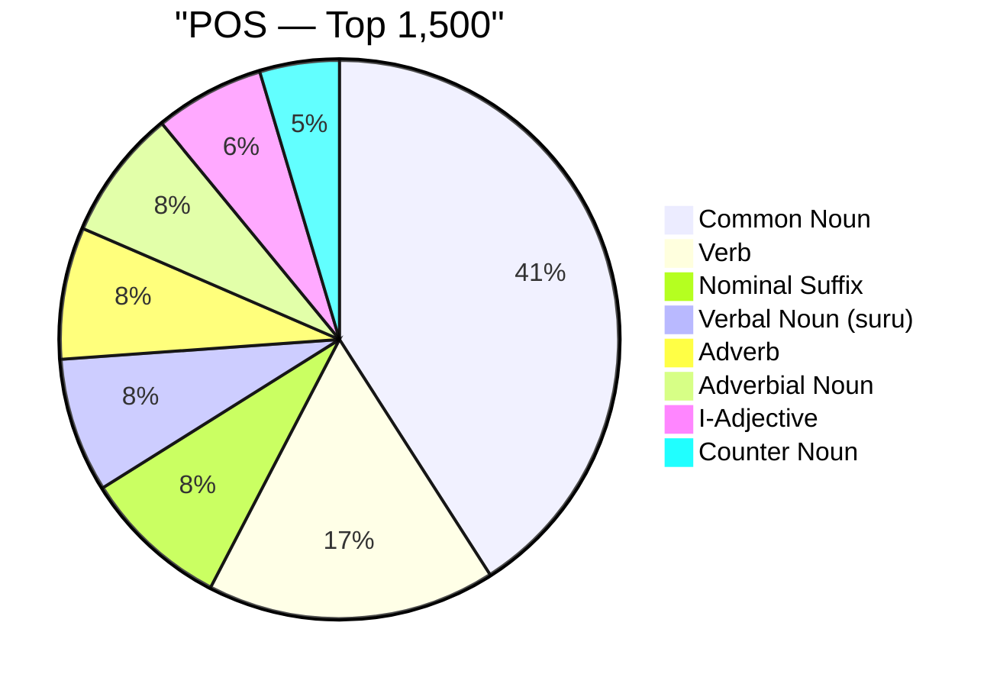
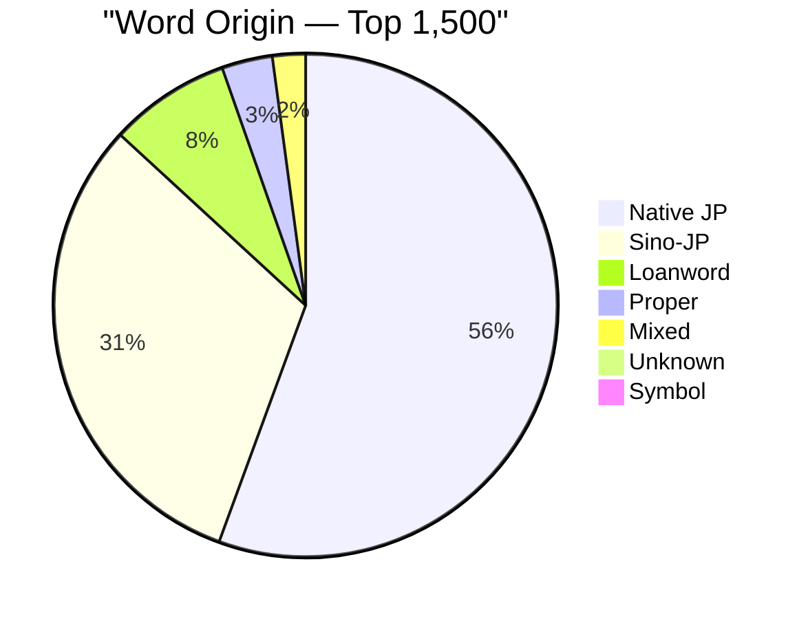
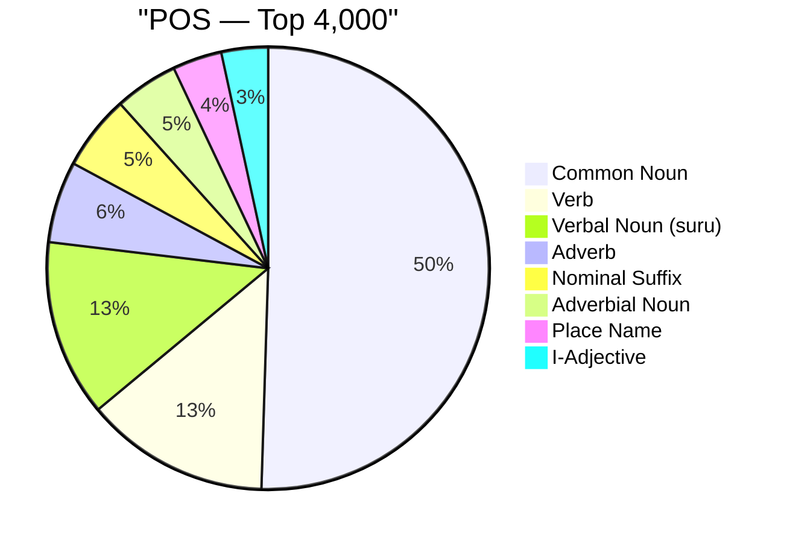
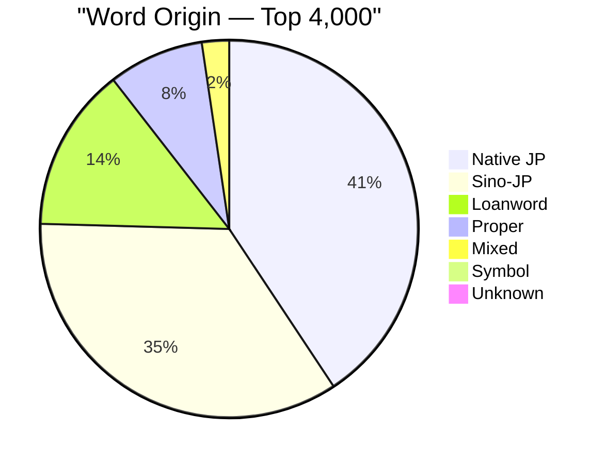
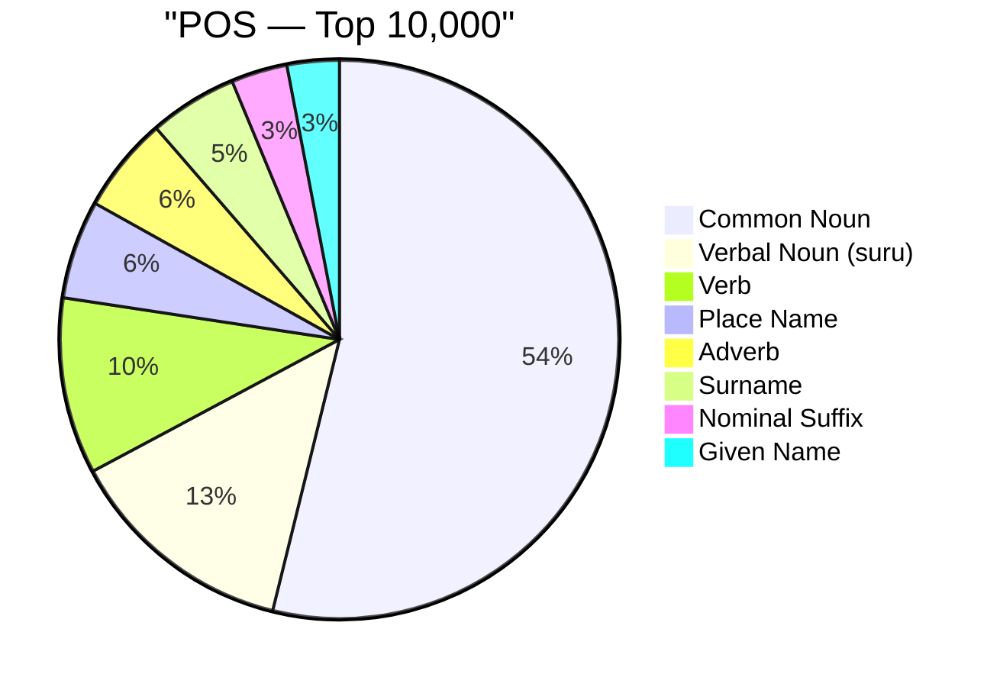
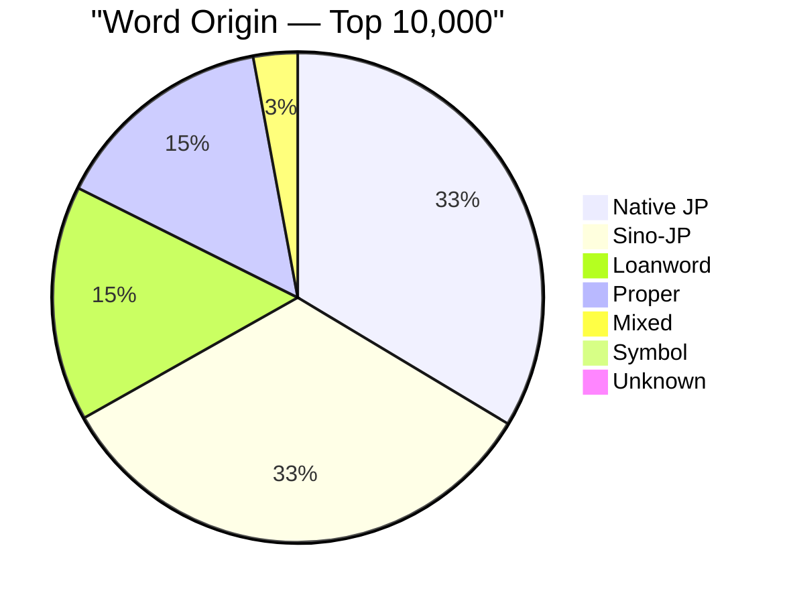
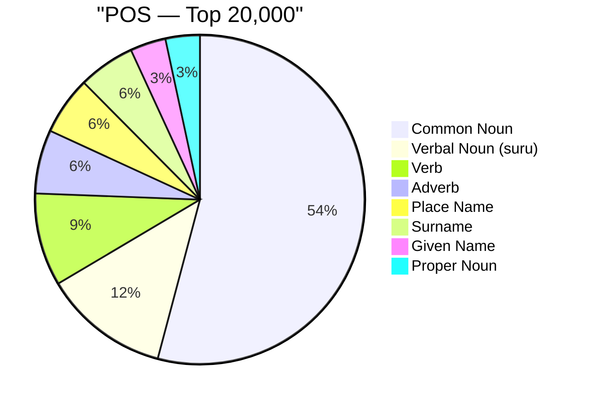
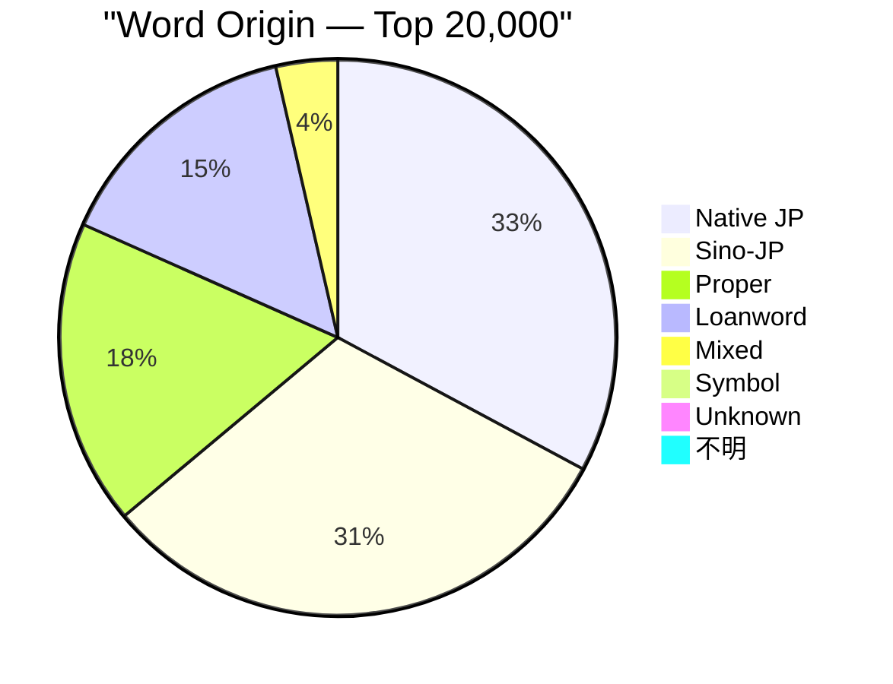

# Vocabulary Tier Breakdown

**Source:** CEJC — Corpus of Everyday Japanese Conversation  
**Tiers are cumulative** — 'top 1,500' = words ranked 1–1,500 by overall frequency across the entire ~2.4 million-word spoken corpus.

Each word can appear multiple times if it belongs to more than one part-of-speech category (e.g. の as a case particle, nominaliser, and sentence-final particle). Charts that say 'POS entries' count each grammatical role separately; charts that say 'unique words' count each word only once.

---

## Top 1,500 Words

**1,416 unique words · 1,850 POS entries**

### Part of Speech Distribution

What grammatical roles make up this vocabulary tier? Each bar represents one POS category. Because a single word can fill multiple roles, the total entries may exceed the unique word count. This chart reveals the grammatical character of high-frequency Japanese — for example, whether nouns, verbs, or particles dominate everyday speech.

```
Common Noun              ████████████████████████████████████████     542.0  (29.3%)
Verb                     ████████████████                             221.0  (11.9%)
Nominal Suffix           ████████                                     112.0  (6.1%)
Verbal Noun (suru)       ████████                                     103.0  (5.6%)
Adverb                   ███████                                      101.0  (5.5%)
Adverbial Noun           ███████                                      100.0  (5.4%)
I-Adjective              ██████                                        84.0  (4.5%)
Counter Noun             █████                                         61.0  (3.3%)
Numeral                  ████                                          52.0  (2.8%)
Aux. Verb                ████                                          49.0  (2.6%)
Na-Adjective             ███                                           38.0  (2.1%)
Pronoun                  ███                                           37.0  (2.0%)
Prefix                   ███                                           35.0  (1.9%)
Nominal Adjective        ███                                           34.0  (1.8%)
Interjection             ██                                            33.0  (1.8%)
Auxiliary                ██                                            26.0  (1.4%)
Sentence-final Particle  █                                             20.0  (1.1%)
Adverbial Particle       █                                             19.0  (1.0%)
Place Name               █                                             19.0  (1.0%)
Person Name              █                                             16.0  (0.9%)
Pre-noun Adjectival      █                                             15.0  (0.8%)
Conjunctive Particle     █                                             12.0  (0.6%)
Given Name               █                                             12.0  (0.6%)
Conjunction              █                                             11.0  (0.6%)
Filler                   █                                             11.0  (0.6%)
Case Particle            █                                             10.0  (0.5%)
Counter Suffix           █                                              9.0  (0.5%)
Adverbial Suffix         █                                              8.0  (0.4%)
Country Name             █                                              7.0  (0.4%)
Adjectival Suffix        █                                              7.0  (0.4%)
Verbal+Adj Noun          █                                              7.0  (0.4%)
Proper Noun              █                                              7.0  (0.4%)
Topic Particle                                                          6.0  (0.3%)
Na-Adj Suffix                                                           4.0  (0.2%)
Surname                                                                 4.0  (0.2%)
Copula Stem                                                             3.0  (0.2%)
Dependent I-Adj                                                         3.0  (0.2%)
Hesitation                                                              2.0  (0.1%)
Verbal Suffix                                                           2.0  (0.1%)
Verbal Suffix (v)                                                       2.0  (0.1%)
Nominalizer Particle                                                    1.0  (0.1%)
Copula Noun                                                             1.0  (0.1%)
Unanalyzed                                                              1.0  (0.1%)
Censored                                                                1.0  (0.1%)
Song/Lyric                                                              1.0  (0.1%)
Babbling                                                                1.0  (0.1%)
```

| Part of Speech (EN)     | 品詞 (JP)                    | Entries | %     |
| ----------------------- | ---------------------------- | ------- | ----- |
| Common Noun             | 名詞-普通名詞-一般           | 542     | 29.3% |
| Verb                    | 動詞-一般                    | 221     | 11.9% |
| Nominal Suffix          | 接尾辞-名詞的-一般           | 112     | 6.1%  |
| Verbal Noun (suru)      | 名詞-普通名詞-サ変可能       | 103     | 5.6%  |
| Adverb                  | 副詞                         | 101     | 5.5%  |
| Adverbial Noun          | 名詞-普通名詞-副詞可能       | 100     | 5.4%  |
| I-Adjective             | 形容詞-一般                  | 84      | 4.5%  |
| Counter Noun            | 名詞-普通名詞-助数詞可能     | 61      | 3.3%  |
| Numeral                 | 名詞-数詞                    | 52      | 2.8%  |
| Aux. Verb               | 動詞-非自立可能              | 49      | 2.6%  |
| Na-Adjective            | 形状詞-一般                  | 38      | 2.1%  |
| Pronoun                 | 代名詞                       | 37      | 2.0%  |
| Prefix                  | 接頭辞                       | 35      | 1.9%  |
| Nominal Adjective       | 名詞-普通名詞-形状詞可能     | 34      | 1.8%  |
| Interjection            | 感動詞-一般                  | 33      | 1.8%  |
| Auxiliary               | 助動詞                       | 26      | 1.4%  |
| Sentence-final Particle | 助詞-終助詞                  | 20      | 1.1%  |
| Adverbial Particle      | 助詞-副助詞                  | 19      | 1.0%  |
| Place Name              | 名詞-固有名詞-地名-一般      | 19      | 1.0%  |
| Person Name             | 名詞-固有名詞-人名-一般      | 16      | 0.9%  |
| Pre-noun Adjectival     | 連体詞                       | 15      | 0.8%  |
| Conjunctive Particle    | 助詞-接続助詞                | 12      | 0.6%  |
| Given Name              | 名詞-固有名詞-人名-名        | 12      | 0.6%  |
| Conjunction             | 接続詞                       | 11      | 0.6%  |
| Filler                  | 感動詞-フィラー              | 11      | 0.6%  |
| Case Particle           | 助詞-格助詞                  | 10      | 0.5%  |
| Counter Suffix          | 接尾辞-名詞的-助数詞         | 9       | 0.5%  |
| Adverbial Suffix        | 接尾辞-名詞的-副詞可能       | 8       | 0.4%  |
| Country Name            | 名詞-固有名詞-地名-国        | 7       | 0.4%  |
| Adjectival Suffix       | 接尾辞-形容詞的              | 7       | 0.4%  |
| Verbal+Adj Noun         | 名詞-普通名詞-サ変形状詞可能 | 7       | 0.4%  |
| Proper Noun             | 名詞-固有名詞-一般           | 7       | 0.4%  |
| Topic Particle          | 助詞-係助詞                  | 6       | 0.3%  |
| Na-Adj Suffix           | 接尾辞-形状詞的              | 4       | 0.2%  |
| Surname                 | 名詞-固有名詞-人名-姓        | 4       | 0.2%  |
| Copula Stem             | 形状詞-助動詞語幹            | 3       | 0.2%  |
| Dependent I-Adj         | 形容詞-非自立可能            | 3       | 0.2%  |
| Hesitation              | 言いよどみ                   | 2       | 0.1%  |
| Verbal Suffix           | 接尾辞-名詞的-サ変可能       | 2       | 0.1%  |
| Verbal Suffix (v)       | 接尾辞-動詞的                | 2       | 0.1%  |
| Nominalizer Particle    | 助詞-準体助詞                | 1       | 0.1%  |
| Copula Noun             | 名詞-助動詞語幹              | 1       | 0.1%  |
| Unanalyzed              | 形態論情報付与対象外         | 1       | 0.1%  |
| Censored                | 伏せ字                       | 1       | 0.1%  |
| Song/Lyric              | 歌                           | 1       | 0.1%  |
| Babbling                | 喃語                         | 1       | 0.1%  |



### Word Origin Distribution

Japanese vocabulary is classified into four main origin types: native Japanese (和語), Sino-Japanese (漢語 — words borrowed from Chinese and written with kanji), foreign loanwords (外来語 — mainly from English, written in katakana), and mixed-origin words (混種語). This distribution shifts dramatically across frequency tiers, revealing how the character of the vocabulary changes as you go deeper.

```
Native JP  ████████████████████████████████████████     786.0  (55.5%)
Sino-JP    ██████████████████████                       442.0  (31.2%)
Loanword   ██████                                       110.0  (7.8%)
Proper     ██                                            46.0  (3.2%)
Mixed      ██                                            30.0  (2.1%)
Unknown                                                   1.0  (0.1%)
Symbol                                                    1.0  (0.1%)
```

| Origin (EN)               | 語種 (JP) | Unique Words | %     |
| ------------------------- | --------- | ------------ | ----- |
| Native Japanese (和語)    | 和        | 786          | 55.5% |
| Sino-Japanese (漢語)      | 漢        | 442          | 31.2% |
| Foreign Loanword (外来語) | 外        | 110          | 7.8%  |
| Proper Noun Origin (固有) | 固        | 46           | 3.2%  |
| Mixed Origin (混種語)     | 混        | 30           | 2.1%  |
| (Unknown)                 |           | 1            | 0.1%  |
| Symbol / Other            | 記号      | 1            | 0.1%  |



### Subcategory Distribution (Top 15)

A finer-grained classification within each POS. Most entries have no subcategory (shown as blank / '-1') — subcategories are only assigned to grammatically irregular or specialised forms. The non-blank entries here are mostly corpus annotations or proper noun sub-types.

```
(none)          ████████████████████████████████████████    1703.0  (98.8%)
代名詞                                                         4.0  (0.2%)
助数詞                                                         2.0  (0.1%)
okay                                                           2.0  (0.1%)
他動詞                                                         2.0  (0.1%)
plus                                                           2.0  (0.1%)
様態                                                           1.0  (0.1%)
伝聞                                                           1.0  (0.1%)
接続詞                                                         1.0  (0.1%)
（オノマトペ）                                                 1.0  (0.1%)
断定                                                           1.0  (0.1%)
完了                                                           1.0  (0.1%)
中学校                                                         1.0  (0.1%)
中毒                                                           1.0  (0.1%)
mama                                                           1.0  (0.1%)
```

| Subcategory    | Entries | %     |
| -------------- | ------- | ----- |
| (none)         | 1703    | 92.1% |
| 代名詞         | 4       | 0.2%  |
| 助数詞         | 2       | 0.1%  |
| okay           | 2       | 0.1%  |
| 他動詞         | 2       | 0.1%  |
| plus           | 2       | 0.1%  |
| 様態           | 1       | 0.1%  |
| 伝聞           | 1       | 0.1%  |
| 接続詞         | 1       | 0.1%  |
| （オノマトペ） | 1       | 0.1%  |
| 断定           | 1       | 0.1%  |
| 完了           | 1       | 0.1%  |
| 中学校         | 1       | 0.1%  |
| 中毒           | 1       | 0.1%  |
| mama           | 1       | 0.1%  |

### Origin × POS Cross-tabulation (top 6 POS)

How do word origins interact with grammatical role? For example: are Sino-Japanese words more likely to be nouns than verbs? Are loanwords exclusively nouns? This table answers those questions. Rows are origin types; columns are the most frequent POS categories.

| Origin    | Common Noun | Verb | Nominal Suffix | Verbal Noun (suru) | Adverb | Adverbial Noun |
| --------- | ----------- | ---- | -------------- | ------------------ | ------ | -------------- |
| Native JP | 218         | 215  | 70             | 7                  | 82     | 51             |
| Sino-JP   | 216         | 0    | 42             | 82                 | 17     | 47             |
| Loanword  | 94          | 0    | 0              | 14                 | 0      | 0              |
| Proper    | 3           | 0    | 0              | 0                  | 0      | 0              |
| Mixed     | 10          | 6    | 0              | 0                  | 2      | 2              |
| Unknown   | 0           | 0    | 0              | 0                  | 0      | 0              |
| Symbol    | 1           | 0    | 0              | 0                  | 0      | 0              |

### Key Insights

- **Native Japanese dominates the core.** Over half (55%) of the top-1,500 words are native Japanese (和語). These are the grammatical glue words, basic verbs, and everyday nouns that make up the backbone of spoken Japanese.

- **Verbs are disproportionately native.** Of the 214 general verb entries, almost all are 和語 — Sino-Japanese verbs are rare because they are expressed as verbal nouns + する (e.g. 勉強する), which is why "Verbal Noun (suru)" is its own large category (5.9%).

- **Foreign loanwords are scarce at the top.** Only 7.8% of the top-1,500 are loanwords (外来語). The highest-frequency words are almost entirely native or Sino-Japanese — loanwords become more common as frequency rank decreases.

- **Subcategory is nearly meaningless here.** 98.8% of entries have no subcategory tag (-1 / blank). Subcategory is only assigned to a handful of grammatical edge cases in this corpus.

---

## Top 4,000 Words

**3,908 unique words · 4,642 POS entries**

### Part of Speech Distribution

What grammatical roles make up this vocabulary tier? Each bar represents one POS category. Because a single word can fill multiple roles, the total entries may exceed the unique word count. This chart reveals the grammatical character of high-frequency Japanese — for example, whether nouns, verbs, or particles dominate everyday speech.

```
Common Noun              ████████████████████████████████████████    1805.0  (38.9%)
Verb                     ███████████                                  482.0  (10.4%)
Verbal Noun (suru)       ██████████                                   462.0  (10.0%)
Adverb                   █████                                        213.0  (4.6%)
Nominal Suffix           ████                                         196.0  (4.2%)
Adverbial Noun           ████                                         166.0  (3.6%)
Place Name               ███                                          129.0  (2.8%)
I-Adjective              ███                                          122.0  (2.6%)
Counter Noun             ██                                            94.0  (2.0%)
Na-Adjective             ██                                            89.0  (1.9%)
Nominal Adjective        ██                                            77.0  (1.7%)
Given Name               ██                                            76.0  (1.6%)
Interjection             ██                                            75.0  (1.6%)
Numeral                  ██                                            72.0  (1.6%)
Surname                  █                                             67.0  (1.4%)
Person Name              █                                             61.0  (1.3%)
Proper Noun              █                                             56.0  (1.2%)
Aux. Verb                █                                             53.0  (1.1%)
Prefix                   █                                             52.0  (1.1%)
Pronoun                  █                                             42.0  (0.9%)
Auxiliary                █                                             32.0  (0.7%)
Adverbial Particle       █                                             25.0  (0.5%)
Sentence-final Particle  █                                             23.0  (0.5%)
Country Name             █                                             23.0  (0.5%)
Verbal+Adj Noun                                                        22.0  (0.5%)
Conjunction                                                            16.0  (0.3%)
Pre-noun Adjectival                                                    16.0  (0.3%)
Conjunctive Particle                                                   14.0  (0.3%)
Filler                                                                 12.0  (0.3%)
Adverbial Suffix                                                       12.0  (0.3%)
Case Particle                                                          10.0  (0.2%)
Counter Suffix                                                         10.0  (0.2%)
Na-Adj Suffix                                                           7.0  (0.2%)
Adjectival Suffix                                                       7.0  (0.2%)
Topic Particle                                                          6.0  (0.1%)
Copula Stem                                                             3.0  (0.1%)
Dependent I-Adj                                                         3.0  (0.1%)
Hesitation                                                              2.0  (0.0%)
Verbal Suffix                                                           2.0  (0.0%)
Verbal Suffix (v)                                                       2.0  (0.0%)
Nominalizer Particle                                                    1.0  (0.0%)
Copula Noun                                                             1.0  (0.0%)
Unanalyzed                                                              1.0  (0.0%)
Censored                                                                1.0  (0.0%)
Song/Lyric                                                              1.0  (0.0%)
Babbling                                                                1.0  (0.0%)
```

| Part of Speech (EN)     | 品詞 (JP)                    | Entries | %     |
| ----------------------- | ---------------------------- | ------- | ----- |
| Common Noun             | 名詞-普通名詞-一般           | 1805    | 38.9% |
| Verb                    | 動詞-一般                    | 482     | 10.4% |
| Verbal Noun (suru)      | 名詞-普通名詞-サ変可能       | 462     | 10.0% |
| Adverb                  | 副詞                         | 213     | 4.6%  |
| Nominal Suffix          | 接尾辞-名詞的-一般           | 196     | 4.2%  |
| Adverbial Noun          | 名詞-普通名詞-副詞可能       | 166     | 3.6%  |
| Place Name              | 名詞-固有名詞-地名-一般      | 129     | 2.8%  |
| I-Adjective             | 形容詞-一般                  | 122     | 2.6%  |
| Counter Noun            | 名詞-普通名詞-助数詞可能     | 94      | 2.0%  |
| Na-Adjective            | 形状詞-一般                  | 89      | 1.9%  |
| Nominal Adjective       | 名詞-普通名詞-形状詞可能     | 77      | 1.7%  |
| Given Name              | 名詞-固有名詞-人名-名        | 76      | 1.6%  |
| Interjection            | 感動詞-一般                  | 75      | 1.6%  |
| Numeral                 | 名詞-数詞                    | 72      | 1.6%  |
| Surname                 | 名詞-固有名詞-人名-姓        | 67      | 1.4%  |
| Person Name             | 名詞-固有名詞-人名-一般      | 61      | 1.3%  |
| Proper Noun             | 名詞-固有名詞-一般           | 56      | 1.2%  |
| Aux. Verb               | 動詞-非自立可能              | 53      | 1.1%  |
| Prefix                  | 接頭辞                       | 52      | 1.1%  |
| Pronoun                 | 代名詞                       | 42      | 0.9%  |
| Auxiliary               | 助動詞                       | 32      | 0.7%  |
| Adverbial Particle      | 助詞-副助詞                  | 25      | 0.5%  |
| Sentence-final Particle | 助詞-終助詞                  | 23      | 0.5%  |
| Country Name            | 名詞-固有名詞-地名-国        | 23      | 0.5%  |
| Verbal+Adj Noun         | 名詞-普通名詞-サ変形状詞可能 | 22      | 0.5%  |
| Conjunction             | 接続詞                       | 16      | 0.3%  |
| Pre-noun Adjectival     | 連体詞                       | 16      | 0.3%  |
| Conjunctive Particle    | 助詞-接続助詞                | 14      | 0.3%  |
| Filler                  | 感動詞-フィラー              | 12      | 0.3%  |
| Adverbial Suffix        | 接尾辞-名詞的-副詞可能       | 12      | 0.3%  |
| Case Particle           | 助詞-格助詞                  | 10      | 0.2%  |
| Counter Suffix          | 接尾辞-名詞的-助数詞         | 10      | 0.2%  |
| Na-Adj Suffix           | 接尾辞-形状詞的              | 7       | 0.2%  |
| Adjectival Suffix       | 接尾辞-形容詞的              | 7       | 0.2%  |
| Topic Particle          | 助詞-係助詞                  | 6       | 0.1%  |
| Copula Stem             | 形状詞-助動詞語幹            | 3       | 0.1%  |
| Dependent I-Adj         | 形容詞-非自立可能            | 3       | 0.1%  |
| Hesitation              | 言いよどみ                   | 2       | 0.0%  |
| Verbal Suffix           | 接尾辞-名詞的-サ変可能       | 2       | 0.0%  |
| Verbal Suffix (v)       | 接尾辞-動詞的                | 2       | 0.0%  |
| Nominalizer Particle    | 助詞-準体助詞                | 1       | 0.0%  |
| Copula Noun             | 名詞-助動詞語幹              | 1       | 0.0%  |
| Unanalyzed              | 形態論情報付与対象外         | 1       | 0.0%  |
| Censored                | 伏せ字                       | 1       | 0.0%  |
| Song/Lyric              | 歌                           | 1       | 0.0%  |
| Babbling                | 喃語                         | 1       | 0.0%  |



### Word Origin Distribution

Japanese vocabulary is classified into four main origin types: native Japanese (和語), Sino-Japanese (漢語 — words borrowed from Chinese and written with kanji), foreign loanwords (外来語 — mainly from English, written in katakana), and mixed-origin words (混種語). This distribution shifts dramatically across frequency tiers, revealing how the character of the vocabulary changes as you go deeper.

```
Native JP  ████████████████████████████████████████    1587.0  (40.6%)
Sino-JP    ██████████████████████████████████          1355.0  (34.7%)
Loanword   ██████████████                               548.0  (14.0%)
Proper     ████████                                     319.0  (8.2%)
Mixed      ██                                            91.0  (2.3%)
Symbol                                                    7.0  (0.2%)
Unknown                                                   1.0  (0.0%)
```

| Origin (EN)               | 語種 (JP) | Unique Words | %     |
| ------------------------- | --------- | ------------ | ----- |
| Native Japanese (和語)    | 和        | 1587         | 40.6% |
| Sino-Japanese (漢語)      | 漢        | 1355         | 34.7% |
| Foreign Loanword (外来語) | 外        | 548          | 14.0% |
| Proper Noun Origin (固有) | 固        | 319          | 8.2%  |
| Mixed Origin (混種語)     | 混        | 91           | 2.3%  |
| Symbol / Other            | 記号      | 7            | 0.2%  |
| (Unknown)                 |           | 1            | 0.0%  |



### Subcategory Distribution (Top 15)

A finer-grained classification within each POS. Most entries have no subcategory (shown as blank / '-1') — subcategories are only assigned to grammatically irregular or specialised forms. The non-blank entries here are mostly corpus annotations or proper noun sub-types.

```
(none)     ████████████████████████████████████████    3977.0  (99.2%)
外国                                                      5.0  (0.1%)
代名詞                                                    4.0  (0.1%)
伝聞                                                      2.0  (0.0%)
断定                                                      2.0  (0.0%)
助数詞                                                    2.0  (0.0%)
okay                                                      2.0  (0.0%)
他動詞                                                    2.0  (0.0%)
Arbeit                                                    2.0  (0.0%)
plus                                                      2.0  (0.0%)
日本                                                      2.0  (0.0%)
percent                                                   2.0  (0.0%)
chocolate                                                 2.0  (0.0%)
turn                                                      2.0  (0.0%)
back                                                      2.0  (0.0%)
```

| Subcategory | Entries | %     |
| ----------- | ------- | ----- |
| (none)      | 3977    | 85.7% |
| 外国        | 5       | 0.1%  |
| 代名詞      | 4       | 0.1%  |
| 伝聞        | 2       | 0.0%  |
| 断定        | 2       | 0.0%  |
| 助数詞      | 2       | 0.0%  |
| okay        | 2       | 0.0%  |
| 他動詞      | 2       | 0.0%  |
| Arbeit      | 2       | 0.0%  |
| plus        | 2       | 0.0%  |
| 日本        | 2       | 0.0%  |
| percent     | 2       | 0.0%  |
| chocolate   | 2       | 0.0%  |
| turn        | 2       | 0.0%  |
| back        | 2       | 0.0%  |

### Origin × POS Cross-tabulation (top 6 POS)

How do word origins interact with grammatical role? For example: are Sino-Japanese words more likely to be nouns than verbs? Are loanwords exclusively nouns? This table answers those questions. Rows are origin types; columns are the most frequent POS categories.

| Origin    | Common Noun | Verb | Verbal Noun (suru) | Adverb | Nominal Suffix | Adverbial Noun |
| --------- | ----------- | ---- | ------------------ | ------ | -------------- | -------------- |
| Native JP | 550         | 470  | 30                 | 176    | 102            | 71             |
| Sino-JP   | 720         | 0    | 349                | 30     | 94             | 90             |
| Loanword  | 474         | 0    | 83                 | 0      | 0              | 0              |
| Proper    | 9           | 0    | 0                  | 1      | 0              | 0              |
| Mixed     | 45          | 12   | 0                  | 6      | 0              | 5              |
| Symbol    | 7           | 0    | 0                  | 0      | 0              | 0              |
| Unknown   | 0           | 0    | 0                  | 0      | 0              | 0              |

### Key Insights

- **The 和語/漢語 gap narrows sharply.** Native Japanese drops from 55% to 41% while Sino-Japanese climbs from 31% to 35%. As frequency rank increases, more Sino-Japanese vocabulary enters — this reflects how 漢語 is used for technical, abstract, and formal concepts.

- **Loanwords nearly double.** Foreign loanwords jump from 7.8% → 14%, the single biggest relative increase of any origin category. Katakana loanwords for everyday objects and concepts (コーヒー, ニュース, etc.) start accumulating here.

- **Proper nouns appear for the first time.** The 固 (proper noun) category reaches 8.2%, mainly place names (地名) and personal names (人名). This reflects that many mid-frequency words in conversation are names of people and locations.

- **The vocabulary becomes more noun-heavy.** Common nouns rise from 28.9% → 38.8% of POS entries. As rank decreases, the vocabulary shifts from grammatical/functional words toward content words.

---

## Top 10,000 Words

**9,573 unique words · 10,749 POS entries**

### Part of Speech Distribution

What grammatical roles make up this vocabulary tier? Each bar represents one POS category. Because a single word can fill multiple roles, the total entries may exceed the unique word count. This chart reveals the grammatical character of high-frequency Japanese — for example, whether nouns, verbs, or particles dominate everyday speech.

```
Common Noun              ████████████████████████████████████████    4670.0  (43.4%)
Verbal Noun (suru)       ██████████                                  1157.0  (10.8%)
Verb                     ████████                                     885.0  (8.2%)
Place Name               ████                                         494.0  (4.6%)
Adverb                   ████                                         481.0  (4.5%)
Surname                  ████                                         442.0  (4.1%)
Nominal Suffix           ██                                           282.0  (2.6%)
Given Name               ██                                           262.0  (2.4%)
Adverbial Noun           ██                                           229.0  (2.1%)
Person Name              ██                                           223.0  (2.1%)
Proper Noun              ██                                           219.0  (2.0%)
Na-Adjective             ██                                           216.0  (2.0%)
Nominal Adjective        █                                            170.0  (1.6%)
I-Adjective              █                                            162.0  (1.5%)
Counter Noun             █                                            136.0  (1.3%)
Interjection             █                                            128.0  (1.2%)
Prefix                   █                                             80.0  (0.7%)
Numeral                  █                                             79.0  (0.7%)
Aux. Verb                                                              56.0  (0.5%)
Pronoun                                                                50.0  (0.5%)
Auxiliary                                                              43.0  (0.4%)
Country Name                                                           42.0  (0.4%)
Verbal+Adj Noun                                                        32.0  (0.3%)
Sentence-final Particle                                                27.0  (0.3%)
Adverbial Particle                                                     26.0  (0.2%)
Conjunction                                                            22.0  (0.2%)
Pre-noun Adjectival                                                    22.0  (0.2%)
Conjunctive Particle                                                   16.0  (0.1%)
Adverbial Suffix                                                       15.0  (0.1%)
Filler                                                                 13.0  (0.1%)
Counter Suffix                                                         13.0  (0.1%)
Case Particle                                                          10.0  (0.1%)
Na-Adj Suffix                                                           9.0  (0.1%)
Adjectival Suffix                                                       7.0  (0.1%)
Topic Particle                                                          6.0  (0.1%)
Verbal Suffix (v)                                                       5.0  (0.0%)
Tari-Adjective                                                          4.0  (0.0%)
Copula Stem                                                             3.0  (0.0%)
Dependent I-Adj                                                         3.0  (0.0%)
Hesitation                                                              2.0  (0.0%)
Verbal Suffix                                                           2.0  (0.0%)
Nominalizer Particle                                                    1.0  (0.0%)
Copula Noun                                                             1.0  (0.0%)
Unanalyzed                                                              1.0  (0.0%)
Censored                                                                1.0  (0.0%)
Song/Lyric                                                              1.0  (0.0%)
Babbling                                                                1.0  (0.0%)
```

| Part of Speech (EN)     | 品詞 (JP)                    | Entries | %     |
| ----------------------- | ---------------------------- | ------- | ----- |
| Common Noun             | 名詞-普通名詞-一般           | 4670    | 43.4% |
| Verbal Noun (suru)      | 名詞-普通名詞-サ変可能       | 1157    | 10.8% |
| Verb                    | 動詞-一般                    | 885     | 8.2%  |
| Place Name              | 名詞-固有名詞-地名-一般      | 494     | 4.6%  |
| Adverb                  | 副詞                         | 481     | 4.5%  |
| Surname                 | 名詞-固有名詞-人名-姓        | 442     | 4.1%  |
| Nominal Suffix          | 接尾辞-名詞的-一般           | 282     | 2.6%  |
| Given Name              | 名詞-固有名詞-人名-名        | 262     | 2.4%  |
| Adverbial Noun          | 名詞-普通名詞-副詞可能       | 229     | 2.1%  |
| Person Name             | 名詞-固有名詞-人名-一般      | 223     | 2.1%  |
| Proper Noun             | 名詞-固有名詞-一般           | 219     | 2.0%  |
| Na-Adjective            | 形状詞-一般                  | 216     | 2.0%  |
| Nominal Adjective       | 名詞-普通名詞-形状詞可能     | 170     | 1.6%  |
| I-Adjective             | 形容詞-一般                  | 162     | 1.5%  |
| Counter Noun            | 名詞-普通名詞-助数詞可能     | 136     | 1.3%  |
| Interjection            | 感動詞-一般                  | 128     | 1.2%  |
| Prefix                  | 接頭辞                       | 80      | 0.7%  |
| Numeral                 | 名詞-数詞                    | 79      | 0.7%  |
| Aux. Verb               | 動詞-非自立可能              | 56      | 0.5%  |
| Pronoun                 | 代名詞                       | 50      | 0.5%  |
| Auxiliary               | 助動詞                       | 43      | 0.4%  |
| Country Name            | 名詞-固有名詞-地名-国        | 42      | 0.4%  |
| Verbal+Adj Noun         | 名詞-普通名詞-サ変形状詞可能 | 32      | 0.3%  |
| Sentence-final Particle | 助詞-終助詞                  | 27      | 0.3%  |
| Adverbial Particle      | 助詞-副助詞                  | 26      | 0.2%  |
| Conjunction             | 接続詞                       | 22      | 0.2%  |
| Pre-noun Adjectival     | 連体詞                       | 22      | 0.2%  |
| Conjunctive Particle    | 助詞-接続助詞                | 16      | 0.1%  |
| Adverbial Suffix        | 接尾辞-名詞的-副詞可能       | 15      | 0.1%  |
| Filler                  | 感動詞-フィラー              | 13      | 0.1%  |
| Counter Suffix          | 接尾辞-名詞的-助数詞         | 13      | 0.1%  |
| Case Particle           | 助詞-格助詞                  | 10      | 0.1%  |
| Na-Adj Suffix           | 接尾辞-形状詞的              | 9       | 0.1%  |
| Adjectival Suffix       | 接尾辞-形容詞的              | 7       | 0.1%  |
| Topic Particle          | 助詞-係助詞                  | 6       | 0.1%  |
| Verbal Suffix (v)       | 接尾辞-動詞的                | 5       | 0.0%  |
| Tari-Adjective          | 形状詞-タリ                  | 4       | 0.0%  |
| Copula Stem             | 形状詞-助動詞語幹            | 3       | 0.0%  |
| Dependent I-Adj         | 形容詞-非自立可能            | 3       | 0.0%  |
| Hesitation              | 言いよどみ                   | 2       | 0.0%  |
| Verbal Suffix           | 接尾辞-名詞的-サ変可能       | 2       | 0.0%  |
| Nominalizer Particle    | 助詞-準体助詞                | 1       | 0.0%  |
| Copula Noun             | 名詞-助動詞語幹              | 1       | 0.0%  |
| Unanalyzed              | 形態論情報付与対象外         | 1       | 0.0%  |
| Censored                | 伏せ字                       | 1       | 0.0%  |
| Song/Lyric              | 歌                           | 1       | 0.0%  |
| Babbling                | 喃語                         | 1       | 0.0%  |



### Word Origin Distribution

Japanese vocabulary is classified into four main origin types: native Japanese (和語), Sino-Japanese (漢語 — words borrowed from Chinese and written with kanji), foreign loanwords (外来語 — mainly from English, written in katakana), and mixed-origin words (混種語). This distribution shifts dramatically across frequency tiers, revealing how the character of the vocabulary changes as you go deeper.

```
Native JP  ████████████████████████████████████████    3202.0  (33.4%)
Sino-JP    ████████████████████████████████████████    3165.0  (33.1%)
Loanword   ██████████████████                          1480.0  (15.5%)
Proper     ██████████████████                          1402.0  (14.6%)
Mixed      ███                                          278.0  (2.9%)
Symbol     █                                             45.0  (0.5%)
Unknown                                                   1.0  (0.0%)
```

| Origin (EN)               | 語種 (JP) | Unique Words | %     |
| ------------------------- | --------- | ------------ | ----- |
| Native Japanese (和語)    | 和        | 3202         | 33.4% |
| Sino-Japanese (漢語)      | 漢        | 3165         | 33.1% |
| Foreign Loanword (外来語) | 外        | 1480         | 15.5% |
| Proper Noun Origin (固有) | 固        | 1402         | 14.6% |
| Mixed Origin (混種語)     | 混        | 278          | 2.9%  |
| Symbol / Other            | 記号      | 45           | 0.5%  |
| (Unknown)                 |           | 1            | 0.0%  |



### Subcategory Distribution (Top 15)

A finer-grained classification within each POS. Most entries have no subcategory (shown as blank / '-1') — subcategories are only assigned to grammatically irregular or specialised forms. The non-blank entries here are mostly corpus annotations or proper noun sub-types.

```
(none)   ████████████████████████████████████████    9035.0  (99.4%)
外国                                                   20.0  (0.2%)
代名詞                                                  4.0  (0.0%)
助数詞                                                  3.0  (0.0%)
日本                                                    3.0  (0.0%)
伝聞                                                    2.0  (0.0%)
断定                                                    2.0  (0.0%)
okay                                                    2.0  (0.0%)
他動詞                                                  2.0  (0.0%)
camera                                                  2.0  (0.0%)
game                                                    2.0  (0.0%)
board                                                   2.0  (0.0%)
Arbeit                                                  2.0  (0.0%)
plus                                                    2.0  (0.0%)
percent                                                 2.0  (0.0%)
```

| Subcategory | Entries | %     |
| ----------- | ------- | ----- |
| (none)      | 9035    | 84.1% |
| 外国        | 20      | 0.2%  |
| 代名詞      | 4       | 0.0%  |
| 助数詞      | 3       | 0.0%  |
| 日本        | 3       | 0.0%  |
| 伝聞        | 2       | 0.0%  |
| 断定        | 2       | 0.0%  |
| okay        | 2       | 0.0%  |
| 他動詞      | 2       | 0.0%  |
| camera      | 2       | 0.0%  |
| game        | 2       | 0.0%  |
| board       | 2       | 0.0%  |
| Arbeit      | 2       | 0.0%  |
| plus        | 2       | 0.0%  |
| percent     | 2       | 0.0%  |

### Origin × POS Cross-tabulation (top 6 POS)

How do word origins interact with grammatical role? For example: are Sino-Japanese words more likely to be nouns than verbs? Are loanwords exclusively nouns? This table answers those questions. Rows are origin types; columns are the most frequent POS categories.

| Origin    | Common Noun | Verbal Noun (suru) | Verb | Place Name | Adverb | Surname |
| --------- | ----------- | ------------------ | ---- | ---------- | ------ | ------- |
| Native JP | 1326        | 71                 | 856  | 0          | 430    | 0       |
| Sino-JP   | 1808        | 892                | 0    | 0          | 43     | 0       |
| Loanword  | 1276        | 187                | 0    | 4          | 0      | 2       |
| Proper    | 28          | 0                  | 0    | 490        | 1      | 440     |
| Mixed     | 188         | 6                  | 29   | 0          | 7      | 0       |
| Symbol    | 44          | 1                  | 0    | 0          | 0      | 0       |
| Unknown   | 0           | 0                  | 0    | 0          | 0      | 0       |

### Key Insights

- **A historic crossover: 和語 ≈ 漢語.** For the first time the two largest origin groups are nearly equal (~33% each). This crossover point around rank 10,000 marks where encyclopedic Sino-Japanese vocabulary overtakes the everyday native lexicon.

- **Proper nouns surge to 14.6%.** Place names and personal names now make up a substantial slice — many mid-frequency spoken words are simply names of people, cities, and countries.

- **Verbs plateau early.** General verbs drop to just 8.5% of entries, half their share at the top-1,500 tier. The ~870 most-used verbs were already captured by rank 10,000; additional verbs become increasingly rare in natural speech.

- **Loanwords stabilise at 15.5%.** Foreign loanwords grow more slowly between tiers 4,000 and 10,000 compared to the jump from 1,500 to 4,000 — suggesting there is a 'loanword ceiling' around 15–16% in this corpus.

---

## Top 20,000 Words

**19,675 unique words · 21,163 POS entries**

### Part of Speech Distribution

What grammatical roles make up this vocabulary tier? Each bar represents one POS category. Because a single word can fill multiple roles, the total entries may exceed the unique word count. This chart reveals the grammatical character of high-frequency Japanese — for example, whether nouns, verbs, or particles dominate everyday speech.

```
Common Noun              ████████████████████████████████████████    9639.0  (45.5%)
Verbal Noun (suru)       █████████                                   2199.0  (10.4%)
Verb                     ███████                                     1625.0  (7.7%)
Adverb                   █████                                       1115.0  (5.3%)
Place Name               ████                                        1017.0  (4.8%)
Surname                  ████                                         990.0  (4.7%)
Given Name               ███                                          623.0  (2.9%)
Proper Noun              ██                                           600.0  (2.8%)
Person Name              ██                                           594.0  (2.8%)
Na-Adjective             ██                                           475.0  (2.2%)
Nominal Suffix           █                                            341.0  (1.6%)
Nominal Adjective        █                                            332.0  (1.6%)
Adverbial Noun           █                                            279.0  (1.3%)
I-Adjective              █                                            253.0  (1.2%)
Interjection             █                                            202.0  (1.0%)
Counter Noun             █                                            162.0  (0.8%)
Prefix                                                                107.0  (0.5%)
Numeral                                                                90.0  (0.4%)
Country Name                                                           68.0  (0.3%)
Aux. Verb                                                              65.0  (0.3%)
Pronoun                                                                56.0  (0.3%)
Auxiliary                                                              49.0  (0.2%)
Verbal+Adj Noun                                                        47.0  (0.2%)
Sentence-final Particle                                                31.0  (0.1%)
Adverbial Particle                                                     26.0  (0.1%)
Pre-noun Adjectival                                                    25.0  (0.1%)
Conjunction                                                            24.0  (0.1%)
Conjunctive Particle                                                   16.0  (0.1%)
Adverbial Suffix                                                       15.0  (0.1%)
Counter Suffix                                                         15.0  (0.1%)
Filler                                                                 14.0  (0.1%)
Tari-Adjective                                                         13.0  (0.1%)
Case Particle                                                          11.0  (0.1%)
Na-Adj Suffix                                                          10.0  (0.0%)
Adjectival Suffix                                                       7.0  (0.0%)
Topic Particle                                                          6.0  (0.0%)
Verbal Suffix (v)                                                       6.0  (0.0%)
Copula Stem                                                             3.0  (0.0%)
Dependent I-Adj                                                         3.0  (0.0%)
Hesitation                                                              2.0  (0.0%)
Verbal Suffix                                                           2.0  (0.0%)
Nominalizer Particle                                                    1.0  (0.0%)
Copula Noun                                                             1.0  (0.0%)
Unanalyzed                                                              1.0  (0.0%)
Censored                                                                1.0  (0.0%)
Song/Lyric                                                              1.0  (0.0%)
Babbling                                                                1.0  (0.0%)
```

| Part of Speech (EN)     | 品詞 (JP)                    | Entries | %     |
| ----------------------- | ---------------------------- | ------- | ----- |
| Common Noun             | 名詞-普通名詞-一般           | 9639    | 45.5% |
| Verbal Noun (suru)      | 名詞-普通名詞-サ変可能       | 2199    | 10.4% |
| Verb                    | 動詞-一般                    | 1625    | 7.7%  |
| Adverb                  | 副詞                         | 1115    | 5.3%  |
| Place Name              | 名詞-固有名詞-地名-一般      | 1017    | 4.8%  |
| Surname                 | 名詞-固有名詞-人名-姓        | 990     | 4.7%  |
| Given Name              | 名詞-固有名詞-人名-名        | 623     | 2.9%  |
| Proper Noun             | 名詞-固有名詞-一般           | 600     | 2.8%  |
| Person Name             | 名詞-固有名詞-人名-一般      | 594     | 2.8%  |
| Na-Adjective            | 形状詞-一般                  | 475     | 2.2%  |
| Nominal Suffix          | 接尾辞-名詞的-一般           | 341     | 1.6%  |
| Nominal Adjective       | 名詞-普通名詞-形状詞可能     | 332     | 1.6%  |
| Adverbial Noun          | 名詞-普通名詞-副詞可能       | 279     | 1.3%  |
| I-Adjective             | 形容詞-一般                  | 253     | 1.2%  |
| Interjection            | 感動詞-一般                  | 202     | 1.0%  |
| Counter Noun            | 名詞-普通名詞-助数詞可能     | 162     | 0.8%  |
| Prefix                  | 接頭辞                       | 107     | 0.5%  |
| Numeral                 | 名詞-数詞                    | 90      | 0.4%  |
| Country Name            | 名詞-固有名詞-地名-国        | 68      | 0.3%  |
| Aux. Verb               | 動詞-非自立可能              | 65      | 0.3%  |
| Pronoun                 | 代名詞                       | 56      | 0.3%  |
| Auxiliary               | 助動詞                       | 49      | 0.2%  |
| Verbal+Adj Noun         | 名詞-普通名詞-サ変形状詞可能 | 47      | 0.2%  |
| Sentence-final Particle | 助詞-終助詞                  | 31      | 0.1%  |
| Adverbial Particle      | 助詞-副助詞                  | 26      | 0.1%  |
| Pre-noun Adjectival     | 連体詞                       | 25      | 0.1%  |
| Conjunction             | 接続詞                       | 24      | 0.1%  |
| Conjunctive Particle    | 助詞-接続助詞                | 16      | 0.1%  |
| Adverbial Suffix        | 接尾辞-名詞的-副詞可能       | 15      | 0.1%  |
| Counter Suffix          | 接尾辞-名詞的-助数詞         | 15      | 0.1%  |
| Filler                  | 感動詞-フィラー              | 14      | 0.1%  |
| Tari-Adjective          | 形状詞-タリ                  | 13      | 0.1%  |
| Case Particle           | 助詞-格助詞                  | 11      | 0.1%  |
| Na-Adj Suffix           | 接尾辞-形状詞的              | 10      | 0.0%  |
| Adjectival Suffix       | 接尾辞-形容詞的              | 7       | 0.0%  |
| Topic Particle          | 助詞-係助詞                  | 6       | 0.0%  |
| Verbal Suffix (v)       | 接尾辞-動詞的                | 6       | 0.0%  |
| Copula Stem             | 形状詞-助動詞語幹            | 3       | 0.0%  |
| Dependent I-Adj         | 形容詞-非自立可能            | 3       | 0.0%  |
| Hesitation              | 言いよどみ                   | 2       | 0.0%  |
| Verbal Suffix           | 接尾辞-名詞的-サ変可能       | 2       | 0.0%  |
| Nominalizer Particle    | 助詞-準体助詞                | 1       | 0.0%  |
| Copula Noun             | 名詞-助動詞語幹              | 1       | 0.0%  |
| Unanalyzed              | 形態論情報付与対象外         | 1       | 0.0%  |
| Censored                | 伏せ字                       | 1       | 0.0%  |
| Song/Lyric              | 歌                           | 1       | 0.0%  |
| Babbling                | 喃語                         | 1       | 0.0%  |



### Word Origin Distribution

Japanese vocabulary is classified into four main origin types: native Japanese (和語), Sino-Japanese (漢語 — words borrowed from Chinese and written with kanji), foreign loanwords (外来語 — mainly from English, written in katakana), and mixed-origin words (混種語). This distribution shifts dramatically across frequency tiers, revealing how the character of the vocabulary changes as you go deeper.

```
Native JP  ████████████████████████████████████████    6417.0  (32.6%)
Sino-JP    ██████████████████████████████████████      6071.0  (30.9%)
Proper     ██████████████████████                      3468.0  (17.6%)
Loanword   ██████████████████                          2883.0  (14.7%)
Mixed      ████                                         701.0  (3.6%)
Symbol     █                                            133.0  (0.7%)
Unknown                                                   1.0  (0.0%)
不明                                                      1.0  (0.0%)
```

| Origin (EN)               | 語種 (JP) | Unique Words | %     |
| ------------------------- | --------- | ------------ | ----- |
| Native Japanese (和語)    | 和        | 6417         | 32.6% |
| Sino-Japanese (漢語)      | 漢        | 6071         | 30.9% |
| Proper Noun Origin (固有) | 固        | 3468         | 17.6% |
| Foreign Loanword (外来語) | 外        | 2883         | 14.7% |
| Mixed Origin (混種語)     | 混        | 701          | 3.6%  |
| Symbol / Other            | 記号      | 133          | 0.7%  |
| (Unknown)                 |           | 1            | 0.0%  |
| 不明                      | 不明      | 1            | 0.0%  |



### Subcategory Distribution (Top 15)

A finer-grained classification within each POS. Most entries have no subcategory (shown as blank / '-1') — subcategories are only assigned to grammatically irregular or specialised forms. The non-blank entries here are mostly corpus annotations or proper noun sub-types.

```
(none)      ████████████████████████████████████████   17924.0  (99.5%)
外国                                                      56.0  (0.3%)
日本                                                       7.0  (0.0%)
代名詞                                                     4.0  (0.0%)
助数詞                                                     3.0  (0.0%)
伝聞                                                       2.0  (0.0%)
断定                                                       2.0  (0.0%)
okay                                                       2.0  (0.0%)
他動詞                                                     2.0  (0.0%)
television                                                 2.0  (0.0%)
camera                                                     2.0  (0.0%)
page                                                       2.0  (0.0%)
game                                                       2.0  (0.0%)
toilet                                                     2.0  (0.0%)
board                                                      2.0  (0.0%)
```

| Subcategory | Entries | %     |
| ----------- | ------- | ----- |
| (none)      | 17924   | 84.7% |
| 外国        | 56      | 0.3%  |
| 日本        | 7       | 0.0%  |
| 代名詞      | 4       | 0.0%  |
| 助数詞      | 3       | 0.0%  |
| 伝聞        | 2       | 0.0%  |
| 断定        | 2       | 0.0%  |
| okay        | 2       | 0.0%  |
| 他動詞      | 2       | 0.0%  |
| television  | 2       | 0.0%  |
| camera      | 2       | 0.0%  |
| page        | 2       | 0.0%  |
| game        | 2       | 0.0%  |
| toilet      | 2       | 0.0%  |
| board       | 2       | 0.0%  |

### Origin × POS Cross-tabulation (top 6 POS)

How do word origins interact with grammatical role? For example: are Sino-Japanese words more likely to be nouns than verbs? Are loanwords exclusively nouns? This table answers those questions. Rows are origin types; columns are the most frequent POS categories.

| Origin    | Common Noun | Verbal Noun (suru) | Verb | Adverb | Place Name | Surname |
| --------- | ----------- | ------------------ | ---- | ------ | ---------- | ------- |
| Native JP | 2825        | 164                | 1553 | 1044   | 0          | 0       |
| Sino-JP   | 3606        | 1727               | 0    | 60     | 0          | 0       |
| Proper    | 37          | 0                  | 0    | 1      | 1012       | 986     |
| Loanword  | 2523        | 280                | 0    | 0      | 5          | 4       |
| Mixed     | 513         | 27                 | 72   | 10     | 0          | 0       |
| Symbol    | 134         | 1                  | 0    | 0      | 0          | 0       |
| Unknown   | 0           | 0                  | 0    | 0      | 0          | 0       |
| 不明      | 1           | 0                  | 0    | 0      | 0          | 0       |

### Key Insights

- **This tier is effectively the full dataset.** The corpus only contains ~12,796 unique words, so 'top 20,000' captures everything.

- **和語 and 漢語 are statistically tied** at ~32% each — at full vocabulary breadth, native and Sino-Japanese words are equally represented in everyday Japanese conversation.

- **Proper nouns (16.4%) now outnumber loanwords (15.3%)** — a reminder that a large fraction of real-world vocabulary is proper names of people and places, not just common words.

- **Mixed-origin words (混種語) grow steadily** from 2.1% → 3.1% across tiers. These are hybrids such as 打ち合わせ (漢+和) or combinations of loanword roots with Japanese suffixes.

