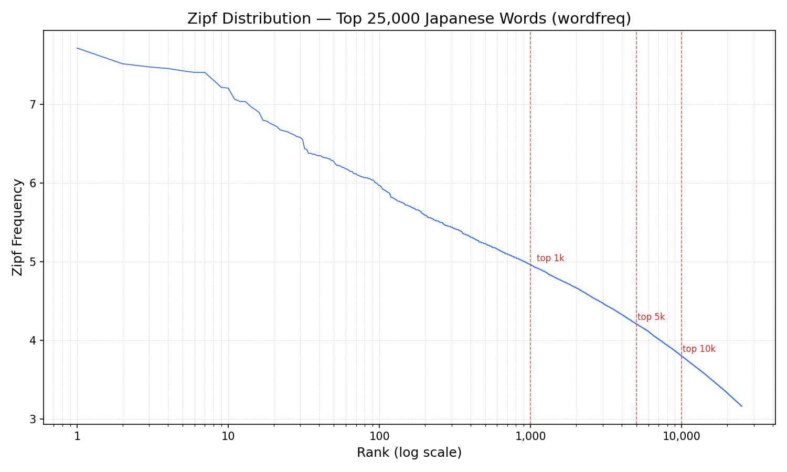
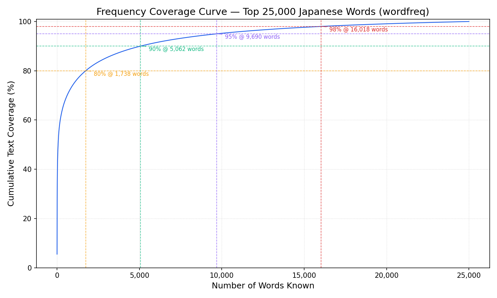
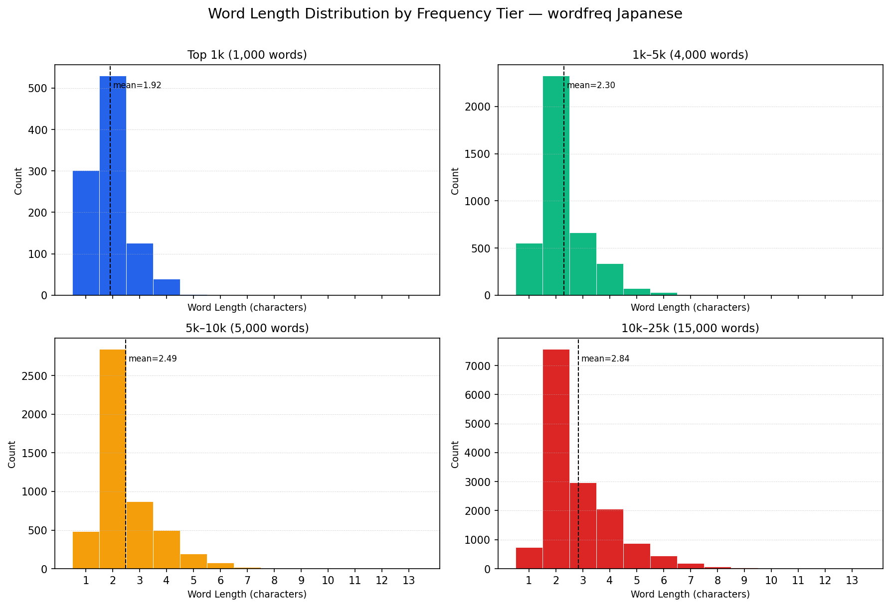
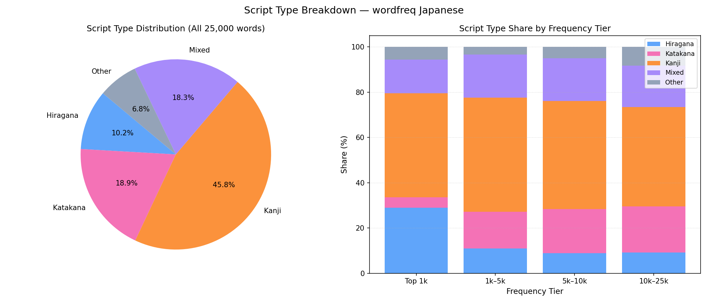
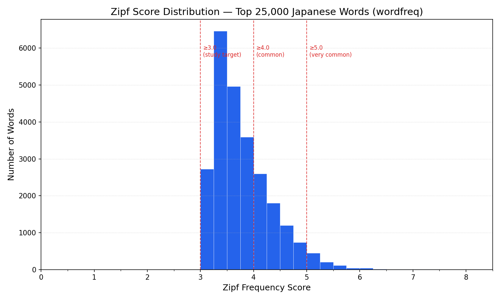
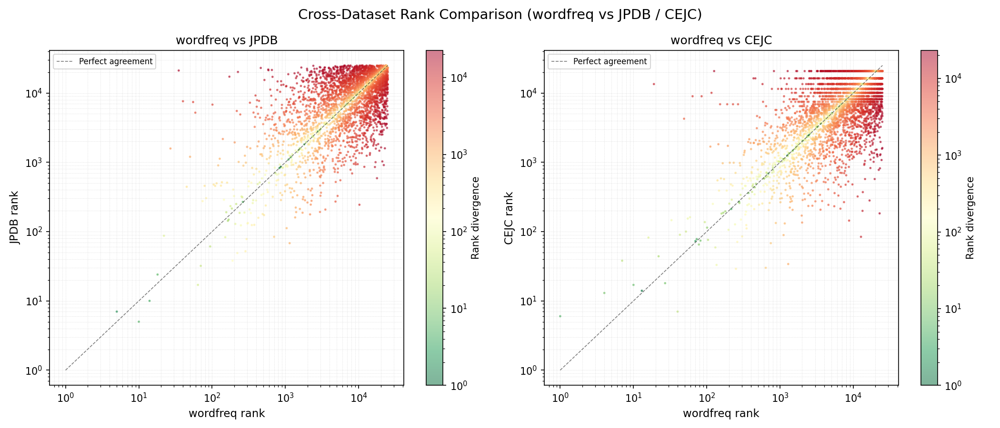

# Data Insights — wordfreq Japanese Dataset

**Dataset:** `top_25000_japanese.csv` — 25,000 most common Japanese words with `frequency` (0–1) and `zipf_frequency` (0–8), generated via the [rspeer/wordfreq](https://github.com/rspeer/wordfreq) library.

---

## 1. Zipf Distribution

The curve is near-linear on a log-log scale, confirming Zipf's law holds well for Japanese. The slope flattens slightly in the top 10 words (particles and conjunctions dominate), then drops steeply before leveling off again past rank 1,000.

Natural vocabulary tiers visible on the curve:

- **Top 1k:** zipf ≥ ~5.1 — core grammar words and highest-frequency vocabulary
- **1k–5k:** zipf ~4.2–5.1 — common everyday vocabulary
- **5k–10k:** zipf ~3.9–4.2 — fluent-level vocabulary
- **10k–25k:** zipf ~3.2–3.9 — advanced/rare vocabulary

---

## 2. Frequency Coverage Curve

Returns sharply diminish past the first few thousand words — the curve is extremely steep early on and nearly flat by 20k.

| Coverage | Words needed |
| -------- | ------------ |
| 80%      | 1,738        |
| 90%      | 5,062        |
| 95%      | 9,690        |
| 98%      | 16,018       |

For learners: mastering ~5k words covers 90% of encountered text. The jump from 90% to 95% requires ~4,600 more words — a significant effort for modest gains.

---

## 3. Word Length by Frequency Tier

Mean word length increases consistently as frequency decreases — confirming **Zipf's law of abbreviation** for Japanese:

| Tier    | Mean length |
| ------- | ----------- |
| Top 1k  | 1.92 chars  |
| 1k–5k   | 2.30 chars  |
| 5k–10k  | 2.49 chars  |
| 10k–25k | 2.84 chars  |

The top 1k is dominated by 1- and 2-character words (particles, basic verbs, common kanji). By the 10k–25k tier the distribution spreads noticeably toward 3–6 characters, with a longer tail extending to 13 characters.

---

## 4. Script Type Breakdown

Cumulative script type composition at each frequency cutoff:

| Script   | Top 1k | Top 5k | Top 10k | Top 25k |
| -------- | ------ | ------ | ------- | ------- |
| Kanji    | 45.9%  | 49.5%  | 48.6%   | 45.8%   |
| Mixed    | 14.8%  | 18.2%  | 18.5%   | 18.3%   |
| Hiragana | 29.0%  | 14.6%  | 11.8%   | 10.2%   |
| Katakana | 4.6%   | 13.8%  | 16.7%   | 18.9%   |
| Other    | 5.7%   | 3.8%   | 4.4%    | 6.8%    |

Key observations:

- **Hiragana plunges from 29% (top 1k) to 10% (top 25k)** — particles, copulas, and grammatical function words cluster at the very top of the frequency list and are nearly absent from lower tiers.
- **Katakana grows from 4.6% (top 1k) to 18.9% (top 25k)** — loanwords are rare at the core but accumulate steadily in lower-frequency ranges.
- **Kanji is consistently dominant** — it peaks around 49–50% in the top 5k–10k range and stays the largest single script type at every tier.
- **Mixed (kanji+kana) is stable** — roughly 15–18% across all cutoffs, reflecting compound and suffixed forms that appear at all frequency levels.

---

## 5. Zipf Score Distribution

The distribution is right-skewed and peaks at zipf ~3.25–3.5. All 25,000 words score ≥ 3.0 by construction (they are the top 25k in the list).

| Threshold  | Words above | % of list |
| ---------- | ----------- | --------- |
| zipf ≥ 3.0 | 25,000      | 100.0%    |
| zipf ≥ 4.0 | 7,258       | 29.0%     |
| zipf ≥ 5.0 | 922         | 3.7%      |

For building filtered vocabulary lists:

- A **zipf ≥ 4.0** cutoff yields ~7,250 words — a practical "common vocabulary" set.
- A **zipf ≥ 5.0** cutoff yields only ~920 words — a minimal core list.
- The bulk of the 25k list (71%) falls in the zipf 3.0–4.0 range, making that band the "advanced learner" territory.

---

## 6. Cross-Dataset Comparison

### Important: datasets index words differently

These three sources do not use the same word representation, which directly affects overlap counts:

- **wordfreq (RSPEER)** — surface/written forms as they appear in web text
- **JPDB** — has both `term` (written/kanji form) and `reading` (kana). Ranked by `reading_frequency` — how often the word is read, not necessarily written as kanji. Also tracks `kana_frequency` separately. ~3% of top 25k words are more commonly seen in kana than kanji form.
- **CEJC** — uses 語彙素 (canonical lexeme/dictionary headword form, e.g. 食べる rather than 食べた), and stores 語彙素読み (kana reading) alongside it. Comparison is against the canonical form, not surface variants.

Because JPDB ranks by reading frequency, bare kanji (like 先, 一, 白) can rank very low in JPDB even when they are highly frequent in written text — their reading frequency is spread across multiple kana readings. This fundamentally limits direct word-for-word comparison.

### Overlap at different tier cutoffs

| Comparison                       | Top 5k | Top 10k | Top 25k |
| -------------------------------- | ------ | ------- | ------- |
| RSPEER ∩ JPDB                    | 48.2%  | 48.4%   | 49.0%   |
| RSPEER ∩ CEJC                    | 47.9%  | 46.2%   | 44.1%   |
| JPDB ∩ CEJC                      | 42.6%  | 39.7%   | 39.4%   |
| All three (RSPEER ∩ JPDB ∩ CEJC) | 32.2%  | 31.8%   | 31.6%   |

Overlap percentages are remarkably stable across all tier sizes — roughly half of any source's top N overlaps with another source, and only ~32% is shared across all three. This consistency holds from 5k to 25k, suggesting the structural gap between sources is not just a low-frequency artifact.

Top 10 words with largest wordfreq vs JPDB rank divergence:

| Word   | wordfreq rank | JPDB rank | Divergence |
| ------ | ------------- | --------- | ---------- |
| 先     | 287           | 24,201    | 23,914     |
| 一     | 78            | 23,901    | 23,823     |
| 白     | 826           | 24,301    | 23,475     |
| 女     | 234           | 23,501    | 23,267     |
| おき   | 1,209         | 24,384    | 23,175     |
| ガン   | 1,017         | 24,001    | 22,984     |
| 好き   | 135           | 23,101    | 22,966     |
| 起こし | 1,746         | 24,659    | 22,913     |
| 落とし | 2,012         | 24,884    | 22,872     |
| 界     | 1,699         | 24,529    | 22,830     |

These divergences are primarily because JPDB ranks by **reading frequency** (kana form), so bare kanji like 先, 一, 白 appear with very low reading frequency in JPDB even though they're common in written text. This is a fundamental difference in indexing philosophy between the two sources.

### Exact String Match Vs Reating Aware Match

The three main sources use different word representations: wordfreq uses surface/written forms; JPDB stores both a `term` (kanji form) and `reading` (kana) and ranks by **reading frequency**, not written frequency (it also tracks `kana_frequency` separately); CEJC uses 語彙素 (canonical lexeme/headword form, e.g. 食べる not 食べた) alongside its kana reading (語彙素読み).

Two methodologies are compared below.

**Result A — exact string match** (surface form only, no reading lookup):

| Comparison    | Top 5k | Top 10k | Top 25k |
| ------------- | ------ | ------- | ------- |
| RSPEER ∩ JPDB | 48.2%  | 48.4%   | 49.0%   |
| RSPEER ∩ CEJC | 47.9%  | 46.2%   | 44.1%   |
| JPDB ∩ CEJC   | 42.6%  | 39.7%   | 39.4%   |
| All three     | 32.2%  | 31.8%   | 31.6%   |

**Result B — reading-aware match** (surface form OR kana reading, readings normalized to hiragana): a word in source A counts as matching source B if its surface form equals either the term/key or the reading in B. This catches cases like RSPEER `くれる` ↔ CEJC `呉れる` or JPDB `今` (reading `いま`) ↔ RSPEER `いま`.

| Comparison    | Top 5k | Top 10k | Top 25k |
| ------------- | ------ | ------- | ------- |
| RSPEER ∩ JPDB | 49.7%  | 49.9%   | 50.4%   |
| RSPEER ∩ CEJC | 53.6%  | 51.1%   | 48.8%   |
| JPDB ∩ CEJC   | 54.6%  | 52.1%   | 54.1%   |
| All three     | 40.3%  | 39.9%   | 40.7%   |

Result B is the better estimate of true conceptual overlap. The JPDB ∩ CEJC improvement (~+12 pp) is the largest because JPDB indexes by reading frequency (kana canonical key) while CEJC indexes by kanji 語彙素 — the same word routinely appears under different scripts in each source. The three-way overlap rises from ~32% to ~40–41%.

Caveats for Result B: (1) **Homophones** — the same kana reading can belong to unrelated words (e.g. particle `ば` vs noun `場`), so reading-based matching can introduce false positives; this affects mostly short function words that already match exactly anyway. (2) **Inflected forms** — RSPEER `なく` (auxiliary) could spuriously match JPDB `泣く` (verb); without POS tagging these are indistinguishable from the kana string alone. (3) **RSPEER kanji words have no reading** — for RSPEER words containing kanji, matching falls back to surface-form only; full reading-aware matching would require MeCab. Result B is therefore an upper bound; the true overlap lies between A and B.

No single list covers everything — even under Result B, only ~40–41% of any tier is shared across all three sources.
